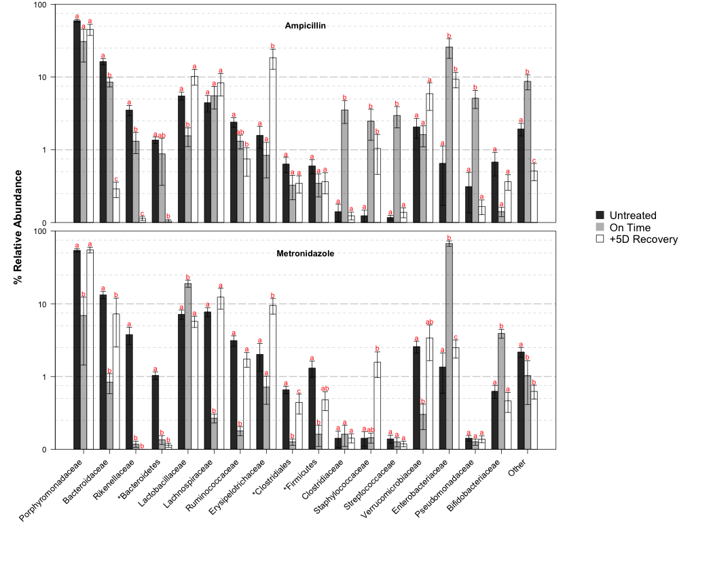
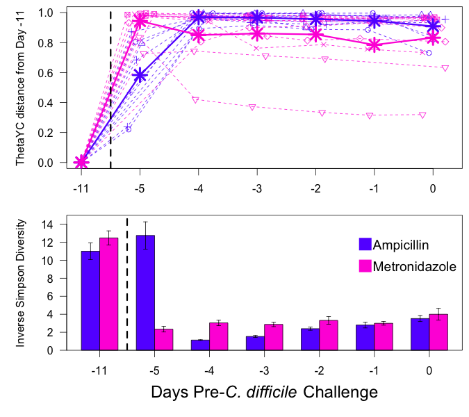
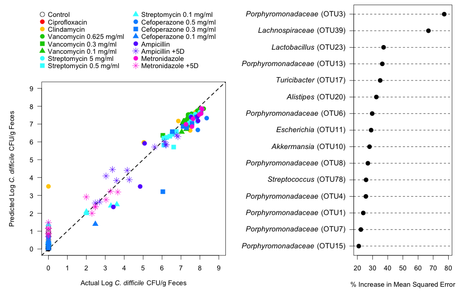
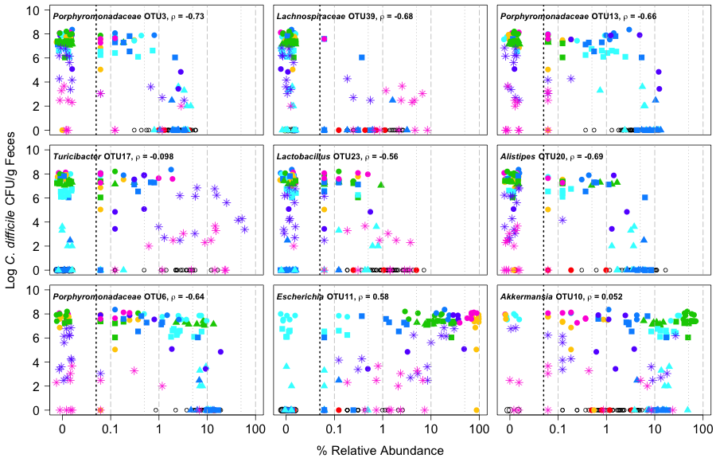

```{r, echo=FALSE, eval=TRUE, warning=FALSE, message=FALSE}
opts_chunk$set("dev" = c("png", "cairo_pdf"))
opts_chunk$set(results = "hold")
opts_chunk$set(fig.show = "hold")
opts_chunk$set(fig.align = "center")
opts_chunk$set(cache = FALSE)
opts_chunk$set(echo = FALSE)
opts_chunk$set(warning = FALSE)


load_package <- function(package){
    if(!(package %in% rownames(installed.packages()))){
        install.packages(package)
    }
    library(package, quietly=TRUE)
}

load_package("randomForest")
load_package("png")

set.seed(6201976)
```


**Running title:** Antibiotic induced alterations of the murine gut microbiota and subsequent effects on colonization resistance against *Clostridium difficile*

**Short title:** Alterations of the murine gut microbiota lead to *C. difficile* colonization

Alyxandria M. Schubert, Hamide Sinani, and Patrick D.
Schloss\*

\* Correspondence:
> Department of Microbiology and Immunology

> University of Michigan

> 1520A Medical Science Research Bldg. I

> 1500 W. Medical Center Dr.

> Ann Arbor, MI 48109

> pschloss@umich.edu

> 734.647.5801


### Abstract


### Introduction

The microbiome, or the diverse community of microorganisms living in and on the body, has an integral role in deterring pathogen colonization and infection [ref]. This native protection by the microbiome from invasive pathogenic species is termed colonization resistance [ref]. It is well established that the gut bacterial microbiome is critical in the hosts’ defense against the pathogen Clostridium difficile [ref]. When this indigenous community is perturbed, this often leads to a loss of resistance. This is especially important in many hospital settings where patients are not only exposed to various types and degrees of perturbations, such as antibiotics, diet changes, chemotherapy, but also exposed to the environmental *C. difficile* spores [ref]. Among hospital-acquired infections in the United States, *C. difficile* infections (CDI) are the number one reported and are responsible for 14,000 deaths a year [ref]. It is not completely understood how different perturbations to the taxonomic composition of the gut microbiota result in a loss of colonization resistance.

In understanding colonization resistance, there is a clear need for more knowledge on *C. difficile* and its interactions between members of the bacterial community. Fecal microbiota transplants, which have been shown to increase *Bacteroidetes* and decrease *Proteobacteria* levels in recipients, have successfully restored colonization resistance in patients and effectively resolved their severe CDI [Seekatz et al. 2014]. Precisely how this occurs is not fully understood, but it emphasizes the strength of the community as a whole in its protective ability. Individual probiotics have not worked with complete success [dendukuri 2005]. In fact, several studies using probiotic mixtures of several bacteria find these members often work better together than by themselves [lawley, Buffie CG et al 2015, stein, hickson 2007]. Thus, studying *C. difficile* in the context of the community it is exposed to is essential for building a complete picture of the variables at play in its ability to colonize. One way of capturing these variables is through statistical modeling. Using models of the microbiome, we can not only identify bacteria with positive and negative roles in *C. difficile* colonization but also predict levels of colonization based on the structure of the microbiota that *C. difficile* encountered.

Although the applications for microbiome modeling are diverse, given the microbiome's relationship to many aspects of human health and disease, there are currently few studies that attempt to model the microbiome to predict disease or estimate health [Pamer, psoriases, schubert]. Microbiome modeling has been successfully applied to the prediction of psoriasis diagnosis, in which a microbiota signature defining subjects with and without psoriasis was discovered [Statnikov et al 2013]. Similarly, incorporating microbiota data into epidemiological based models that classify *C. difficile* diagnosis significantly enhances predictive power [Schubert et al. 2013]. In a time-series model of microbiome dynamics, the microbiota response to *C. difficile* alone, clindamycin alone, or clindamycin followed by *C. difficile* challenge was predicted (spearman correlation of 0.62) [Stein et al. 2013]. Lastly, the microbiota response to *Citrobacter rodentium* infection over time was modeled to capture time-dependent signatures of the microbiota [Belzer et al 2014].

The purpose of this investigation was to expand our current knowledge of the effects of various perturbations on the microbiota's colonization resistance abilities against *C. difficile* and identify important members for this function. Through the administration of different antibiotic types, doses, and varying recovery time, we altered the murine gut microbiota and observed these structural changes using 16S rRNA sequencing. The resultant gut communities were then challenged with *C. difficile* spores. Using this data, we built a random forest model to predict *C. difficile* colonization levels based on the microbiota structure. Through this analysis, we have identified groups of related species with antagonistic relationships with *C. difficile* colonization. Modeling identified bacteria that did not have significant correlations with *C. difficile* but were important in prediction accuracy. These findings show we can successfully apply modeling techniques to accurately measure the colonization resistance ability of a given microbiome.


### Materials and Methods

***Animal care.*** We used 5-8 week old C57Bl/6 mice for all our experiments. These mice were reared under SPF conditions within the animal facility at the University of Michigan. All animal-related protocols and experiments were approved by the University Committee on Use and Care of Animals at the University of Michigan.

***Antibiotic administration.*** Mice were administered one of seven different antibiotics, including cefoperazone, vancomycin, metronidazole, streptomycin, ciprofloxacin, ampicillin, and clindamycin. The route of administration depended on the specific antibiotic. Cefoperazone (either 0.5 mg/ml, 0.3mg/ml, or 0.1 mg/ml), vancomycin (0.625 mg/ml, 0.3 mg/ml, or 0.1 mg/ml), streptomycin (5 mg/ml, 0.5 mg/ml, or 0.1 mg/ml), metronidazole (0.5 mg/ml), and ampicillin (0.5 mg/ml) were all administered in the mouse drinking water for 5 days. Ciprofloxacin (10 mg/kg) was administered via oral gavage and clindamycin (10 mg/kg) was administered via IP injection. Mice that did not receive antibiotics were used as negative controls for these experiments.

***C. difficile preparation and challenge*** All antibiotic-treated mice were given 24 hours to recover with untreated drinking water prior to *C. difficile* challenge. *C. difficile* strain 630Δerm spores were used in all experiments [cite dena lyras]. Spores were prepared from a single large batch whose concentration was determined within the week prior to each *C. difficile* challenge [cite paul?]. On the day of challenge 10^3 *C. difficile* spores were administered to mice via oral gavage. Immediately following this challenge, the remaining *C. difficile* inoculum was diluted in a series and plated to confirm the correct dosage.

***Sample collection and plating*** Fecal samples were freshly collected for each mouse on the day of *C. difficile* challenge (day 0). On the day after the challenge (day 1), another fecal sample was weighed and diluted under anaerobic conditions with anaerobic PBS. The number of colony forming units (CFU) were counted following 24 hrs growth on TCCFA plates at 37°C under anaerobic conditions [cite plates].

***DNA extraction and sequencing*** Total bacterial DNA was extracted from each  day 0 stool sample using the MOBIO PowerSoil®-htp 96 Well Soil DNA Isolation Kit. Sequencing preparation and sequencing was carried out as previously described (Kozich JJ et al. 2013). Briefly, the V4 region of the 16S rRNA gene was amplified, purified, and pooled in equimolar concentrations. These libraries were then mixed with Illumina-prepared PhiX control libraries.

***Sequence curation*** These sequences were curated using mothur as previously described (Kozich JJ et al and Schloss PD et al). Sequences were binned into operational taxonomic units (OTUs) using a 3% dissimilarity cutoff. Taxonomic assignments were determined by using a naïve Bayesian classifier with the Ribosomal Database Project (RDP) training set (version 9) requiring an 80% bootstrap confidence score. In parallel to the fecal samples, we also sequeced a mock community where we knew the true sequence of the 16S rRNA gene sequences. Analysis of the mock community data indicated that the error rate following our cuation procedure was 0.0X%. In order to avoid biases due to uneven sampling, samples were normalized to 1,625 sequences per samples [Schloss, reducing effects]. All 16S rRNA gene sequence data and metadata are available through the Sequence Read Archive under accession XXXXXX.

***Statistical analysis and modeling*** All analyses were conducted using R version 3.1.2. OTUs were considered for analysis if their average relative abundance within any treatment group was at least 1% (43 OTUs). Spearman rank correlation analysis was performed with a Benjamini and Hochberg adjustment between OTU counts or diversity levels and *C. difficile* CFU/g feces. Comparison of bacterial levels among titration groups or delayed groups of the same antibiotic was performed using the Kruskall-Wallis rank sum test followed by pairwise Wilcoxon rank sum tests with a Benjamini and Hochberg adjustment. Comparison of log10 transformed *C. difficile* CFU/g feces between experimental groups was calculated using ANOVA and subsequently pairwise T tests with a Benjamini and Hochberg adjustment. Random forest regression models were constructed using the randomForest R package using 5,000 trees [ref]. The regression was performed using the log10 transformation of the number of CFU/g fecal material as the dependent variable and the 43 OTUs as predictor variables. Complete analysis scripts are available at the online repository for this study (https://github.com/SchlossLab/Schubert_AbxD01_mBio_2015).


### Results

```{r top_dose_cfu_analysis}
cfu <- read.table(file="data/process/abxD1.counts")
cfu_top_dose <- cfu[cfu$experiment == "top_dose" & cfu$abx != "control",]
cfu_top_dose_summary <-aggregate(cfu_top_dose$CFU, by=list(cfu_top_dose$abx), summary)
treatments <- cfu_top_dose_summary$Group.1
cfu_top_dose_summary <- format(cfu_top_dose_summary$x, scientific=T, digits=2)
rownames(cfu_top_dose_summary) <- treatments
```

```{r amova_analysis}
amova <- scan(file="data/process/abxD0.trim.contigs.good.unique.good.filter.unique.precluster.pick.pick.pick.an.unique_list.topdose.thetayc.0.03.lt.ave.amova", what="", sep="\n", quiet=T)

comparison_line <- amova[(1:length(amova)) %% 6 == 1]
comparison <- gsub("\t.*", "", comparison_line)

pvalue_line <- amova[(1:length(amova)) %% 6 == 0]
pvalue <- gsub("p-value: ", "", pvalue_line)
pvalue <- gsub("\\*", "", pvalue)
pvalue <- gsub("<", "", pvalue)
pvalue <- as.numeric(pvalue)

comparison <- comparison[-1]
pvalue <- pvalue[-1]

sig <- p.adjust(pvalue, method="BH")
```

***Levels of colonization resistance are associated with the initial structure of the gut microbiota.*** In mouse models of CDI, the baseline, untreated murine microbiota is completely resistant to *C. difficile* colonization. It was previously shown that C57Bl/6 mice treated with cefoperazone [], clindamycin [], or clindamycin in combination with a five antibiotic cocktail [] had decreased colonization resistance. To further characterize structural shifts in the microbiota associated with this loss of protective function, we chose a panel of seven representatives from six classes of antibiotics to differentially alter the microbiota and assess their resistance to *C. difficile* colonization (**Table 1**). On the day after the mice were challenged with *C. difficile* we enumerated the density of *C. difficile* in the animals' feces. We observed reproducibly high levels of *C. difficile* colonization in mice treated with cefoperazone, metronidazole, and streptomycin. We observed variable levels of *C. difficile* colonization in mice treated with amipicilin. Only one of six mice receiving vancomycin was colonized with *C. difficile* and none of the mice that received ciprofloxacin were colonized. We next sequenced the 16S rRNA genes from the fecal communities sampled at the time of *C. difficile* challenge to characterize the populations within untreated mice that provided for colonization resistance. The antibiotic treatments resulted in distinct and reproducible microbiota structures (Figure 1; AMOVA, P<`r round(max(sig[grepl("control", comparison)]), 2)`). In addition, all of the other comparisons were significantly different from each other (AMOVA, P<`r round(max(sig[!grepl("control", comparison)]), 2)`). These results indicate that perturbing the gut microbiota with antibiotics resulted in non-overlapping community structures that yielded significant variation in susceptibility to colonization when challenged with *C. difficile*.


```{r top_dose_correlation}
corr_data <- read.table(file="data/process/top_dose_corr.tsv", header=T)
families <- gsub(".*;", "", corr_data$taxonomy)
ave_corr_family_agg <- aggregate(corr_data$sig_corrs, by=list(families), function(x){ c(mean(x), length(x))})
ave_corr_family <- round(ave_corr_family_agg$x[,1], 2)
names(ave_corr_family) <- ave_corr_family_agg$Group.1

N_family <- round(ave_corr_family_agg$x[,2], 2)
names(N_family) <- ave_corr_family_agg$Group.1
```

***Correlation analysis reveals potentially protective bacteria.*** To identify bacterial taxa that could be associated with resistance or susceptibility to *C. difficile*, we measured the correlation between the relative abundance of each OTU that had an average abundance greater than 0.1% on the day of inoculation with the level of *C. difficile* colonization 24 hours later (Figure 2). OTUs associated with providing resistance against *C. difficile* (N=`r sum(corr_data$sig_corrs < 0)`) outnumbered those with associated associated with susceptibility (N=`r sum(corr_data$sig_corrs > 0)`). Among various bacterial families, three were consistently associated with *C. difficile* resistance: *Porphyromonadaceae* (ρ<sub>average</sub>=`r ave_corr_family["Porphyromonadaceae"]`, N=`r N_family["Porphyromonadaceae"]` OTUs), *Lachnospiraceae* (ρ<sub>average</sub>=`r ave_corr_family["Lachnospiraceae"]`, N=`r N_family["Lachnospiraceae"]` OTUs), and *Ruminococcaceae* (ρ<sub>average</sub>=`r ave_corr_family["Ruminococcaceae"]`, N=`r N_family["Ruminococcaceae"]` OTUs). Two OTUs from the *Proteobacteria* had a significant association with *C. difficile* colonization. These included OTUs associated with the genera *Pseudomonas* (ρ=`r round(corr_data[families=="Pseudomonadaceae","sig_corrs"], 2)`) and *Escherichia* (ρ=`r round(corr_data[families=="Enterobacteriaceae","sig_corrs"], 2)`). Overall, these results suggest that several large groups of related OTUs, particularly within the *Firmicutes* and *Bacteroidetes*, may participate in colonization resistance against *C. difficile*, while members of the *Proteobacteria* phylum may be involved in susceptibility.


```{r titration}
cfu <- read.table(file="data/process/abxD1.counts")
titration <- cfu[cfu$abx %in% c("vanc", "cef", "strep"),]

vanc <- titration[titration$abx=="vanc",]
vanc.test <- pairwise.t.test(log(vanc$CFU+1), factor(vanc$dose), method="BH")

strep <- titration[titration$abx=="strep",]
strep.test <- pairwise.t.test(log(strep$CFU+1), factor(strep$dose), method="BH")

cef <- titration[titration$abx=="cef",]
cef.test <- pairwise.t.test(log(cef$CFU+1), factor(cef$dose), method="BH")

```

***Reduced perturbation of the microbiota increases colonization resistance.*** Based on the *C. difficile* colonization levels in our seven antibiotic treatments, we hypothesized that reducing the dose of antibiotics that the mice received would result in a reduced perturbation to the microbiota and a reduced sensitivity to *C. difficile*. In addition to the previous treatments, we treated mice with cefoperazone (0.3 and 0.1 mg/mL), streptomycin (0.5 and 0.1 mg/mL), and vancomycin (0.3 and 0.1 mg/mL). These antibiotics were selected because they are thought to target a broad spectrum of bacteria (i.e. cefoperazone), Gram-negative (i.e. streptomycin) and Gram-positive (i.e.  vancomycin) bacteria. Vancomycin was also selected because although the community was quite different from untreated mice, we did not observe high levels of colonization and we anticipated that lower doses might result in a community structure that would result in colonization. As expected, colonization levels decreased significantly in all mice receiving reduced doses of cefoperazone (P<`r round(max(cef.test$p.value, na.rm=T), 2)`) and streptomycin (P<`r round(max(strep.test$p.value, na.rm=T), 2)`; Figure 3). Although the 0.625 mg/mL dose of vancomycin did not result in colonization, the 0.3 and 0.1 mg/mL doses of vancoymicin resulted in similarly high levels of colonization (P=`r round(vanc.test$p.value["0.3","0.1"], 2)`).


Titrating cefoperazone resulted in a shift in dominance from the *Bacteroidetes* to the *Firmicutes* phylum with increasing antibiotic dose. Most notable was the increase in the relative abundance of OTUs associated with resistance including the *Porphyromonadaceae* and *Alistipes* and a reduction in OTUs associated with susceptibility including members of the *Proteobacteria*, *Clostridium*, and *Staphylococcus*. The relative abundance of other OTUs associated with protection including the *Lactobacillus*, *Lachnospiraceae*, and *Ruminococcaceae* did not change as expected based on the initial correlation analysis; however, these OTUs were present at levels similar to the untreated mice.

The at the lowest streptomycin titration, mice retained significantly higher abundances of *Alistipes* and *Anaeroplasma* (p<0.05), which we found to be strongly associated with colonization resistance. The relative abundances of the *Porphyromonodaceae*, *Lachnospiraceae*, *Ruminococcaceae* were unchanged, but were present at similarly high levels to those found in the untreated mice.

Although the vancomycin titration yielded a number of large changes in the abundance of individual populations, there was no recovery of colonization resistance. The relative abundance of many of the populations associated with resistance (*Porphyromonadaceae*, *Lachnospiraceae*, *Anaeroplasma*) increased with decreased vancomycin dosage; however, with the exception of the *Lactobacillus* populations, they did not reach the levels observed in the untreated mice. In addition, all of the vancomycin-treated mice had high levels of OTUs affiliated with the *Akkermansia* and *Enterobacteriaceae*.

Together, these results suggest that individual populations are not sufficient to provide colonization resistance. Rather, resistance is likely a product of the overall composition of the community.


> ### CFU stats comparison
>
> For comparison of the CFU's among titration groups:

```{r, eval=TRUE}
file<-read.csv("~/Documents/Github/abxD01/Figure3/abxD01.final.tx2.subsample.alltitrations.forlogscale.csv", header=T)
file<-file[!grepl("untr", file$expgroup),]
file$nextDayCFU <- log10(file$nextDayCFU+1)

cef <- file[file$abx=="Cefoperazone", 3:4]
strep <- file[file$abx=="Streptomycin", 3:4]
vanc <- file[file$abx=="Vancomycin", 3:4]

diffs <- function(data){
  data.aov<-aov(data$nextDayCFU ~ data$expgroup)
  anova(data.aov)
  pairwise.t.test(data$nextDayCFU, data$expgroup, p.adjust="BH")
}

diffs(cef)
diffs(strep)
diffs(vanc)

```

> ### Figure 3: Barchart
>
> This figure shows the effect of titrating antibiotics on the community as well as the resulting *C. difficile* levels.  
>
> The file/fileIDS should be matched by the titration.
> Input files on github:
> 1. abxD01.final.tx.2.subsample.alltitrations.forlogscale.csv
> 2. alltitrations_tx2_barchart_ids.csv
>
> Uses functions in R scripts folder: stacked.barcharts.r, findStatLetters.r, barplotBeside.r

```{r, eval=FALSE}

stackedbarcharts(file = "~/Documents/Github/abxD01/Figure3/abxD01.final.tx2.subsample.alltitrations.forlogscale.csv", fileIDS = "~/Documents/Github/abxD01/Figure3/alltitrations_tx2_barchart_ids.csv", excludeGroup="untr", divide = TRUE)

```

***Allowing recovery of specific bacterial populations restores colonization resistance.*** Several studies have demonstrated that perturbed communities can return to a "healthy" state in which resistance to *C. difficile* is restored [refs]. We allowed the microbiota of the mice that received the full metronidazole and ampicillin treatment to recover an additional five days. We again sought to test the relationships that we identified in the correlation-based analysis using animals with the partially recovered microbiota. On Day 1 post challenge of the metronidazole-treated mice who were allowed to recover five extra days, we observed a significant decrease in *C. difficile* level of CFU per g feces (p<XXX0.0001XXX). Within their microbiota there were significant increases (p<XXX0.05XXX) in overall abundances of *Porphyromonadaceae*, *Ruminococcaceae*, and *Lachnospiraceae* to abundances similar to those of untreated mice, and significant decreases (p<XXX0.05XXX) in levels of *Enterobacteriaceae*. In contrast, the ampicillin-treated mice that were given five extra days of recovery prior to *C. difficile* challenge did not experience an increase in colonization resistance. Inspection of their microbiota indicated that they still had significantly reduced levels of bacteria correlated with *C. difficile* protection, including *Bacteroides*, *Alistipes*, and *Ruminoccocaceae* compared with untreated animals (p<XXX0.05XXX). Importantly, the level of *Enterobacteriaceae* was not significantly reduced with additional recovery time. Given the smaller changes towards a protective baseline state, it was not all that surprising that we were unable to detect significant changes in subsequent *C. difficile* levels (p=XXX0.12XXX). Together, these results strengthen the importance of *Porphyromonadaceae*, *Lachnospiraceae*, *Ruminococcaceae*, and *Enterobacteriaceae* in setting up the right environment of negatively and positively correlated bacteria to affect the outcome of *C. difficile* colonization.

--------



**Figure 4. Changes in the average relative abundance for family level phylotypes durin the period of recovery prior to challenge with *C. difficile*.** Each row depicts a different antibiotic that was allowed to recover. Black bars represent untreated animals. Grey bars represent animals given 1 day of recovery off antibiotics as in Figure 1. Error bars indicate the standard error of the mean.

--------

> How is this relevant? - PDS



**Supplemental Figure 2. Changes between untreated and recovery days.** A) The average thetaYC distance between pretreatment (day -11) and recovery days (days -5 through -1) is represented by circles connected by solid lines. Dashed lines with the same symbol indicate individual mice from the same cage. Antibiotic treatment is indicated by color. B) The average level of the inverse simpson diversity index is plotted by antibiotic treatment across time. Error bars show standard error of the mean. Mice were challenged with *C. difficile* on day 0.

--------
> How is this relevant? - PDS
> ### Supplemental Figure 2A: Differences between recovery days' thetayc

```{r, eval=FALSE}
file <- "~/Desktop/mothur/abxD01/abxD01.final.an.unique_list.0.03.recovery.vancomycin.thetayc.0.03.lt.ave.dist"
diffs <- getDistDiffs(file=file)

#metadata <- read.delim(file="~/Desktop/mothur/abxD01/searchme.txt", header = T, stringsAsFactors=F)
metadata$sample[1951] <- "007-1D1" # ID was messed up
names(metadata)[3] <- "group"


par(mfrow=c(2, 1))
par(mar=c(3, 5, 0.5, 0.5), las=2, mgp=c(3, 1, 0))
plot.dist.from(dist.from = diffs)

# Arrange diversity data for supplemental figure 2B

diversity <- read.delim(file="~/Desktop/mothur/abxD01/abxD01.final.an.unique_list.groups.ave-std.summary", sep="\t", header=T, stringsAsFactors=F)

diversity$group[2046] <- "007-1D1"
diversity$group[124] <- "007-1D1"

div.ind <- match(diversity$group[diversity$method=="ave"], metadata$sample)
div.group <- metadata$group[div.ind]
div.time <- metadata$time[div.ind]
div.abx <- metadata$abx[div.ind]
div.day <- metadata$day[div.ind]

delay.invsimp <- diversity$invsimpson[div.time=="delayed" & diversity$method=="ave"]
delay.shannon <- diversity$shannon[div.time=="delayed" & diversity$method=="ave"]
delay.abx <- div.abx[div.time=="delayed" & diversity$method=="ave"]
delay.day <- div.day[div.time=="delayed" & diversity$method=="ave"]
delay.group <- div.group[div.time=="delayed" & diversity$method=="ave"]

delay.diversity <- cbind(group=delay.group, day=delay.day, abx=delay.abx, invsimp=delay.invsimp, shannon=delay.shannon)

recov.diversity <- matrix(nrow=7)
row.names(recov.diversity) <- c(-11, -5:0)

amp.div <- matrix(nrow=7, ncol=2)
row.names(amp.div) <- c(-11, -5:0)
colnames(amp.div) <- c("amp.avg", "amp.se")
library(plotrix)
for(j in 1:7){
  matches <- delay.diversity[,3]=="amp" & delay.diversity[,2]==row.names(amp.div)[j]
  amp.div[j, "amp.avg"] <- mean(as.numeric(delay.diversity[matches, "invsimp"]))
  amp.div[j, "amp.se"] <- std.error(as.numeric(delay.diversity[matches, "invsimp"]))
}

metro.div <- matrix(nrow=7, ncol=2)
row.names(metro.div) <- c(-11, -5:0)
colnames(metro.div) <- c("metro.avg", "metro.se")
for(j in 1:7){
  matches <- delay.diversity[,3]=="metro" & delay.diversity[,2]==row.names(metro.div)[j]
  metro.div[j, "metro.avg"] <- mean(as.numeric(delay.diversity[matches, "invsimp"]))
  metro.div[j, "metro.se"] <- std.error(as.numeric(delay.diversity[matches, "invsimp"]))
}

recov.diversity <- cbind(amp.div, metro.div)

# Plot for second part of supplemental figure 2
transpose <-t(recov.diversity)
colors <- c(amp="#6600FF",
            metro="#FF00DBFF")
par(mar=c(5, 5, 0.5, 0.5), las = 2, mgp=c(3, 1, 0))
bp <- barplot(transpose[c("amp.avg", "metro.avg"), ], beside=T, ylim=c(0, 15),
              ylab="Inverse Simpson Diversity", xlab="",
              col=colors, xaxt='n' )
xticks <- apply(bp, 2, mean)
axis(1, at=xticks, label=c(-11, -5:0), las=1)
mtext(text = expression(paste("Days Pre-", italic("C. difficile"), " Challenge")), side = 1, line = 3, cex = 1.5, las=0)
abline(v=mean(xticks[1:2]), lty="dashed", lwd=3)
box()

x <- c(bp[1,], bp[2,])
y <- as.numeric(c(transpose[1,], transpose[3,]))
se <- as.numeric(c(transpose[2,], transpose[4,]))
d <- as.data.frame( cbind(x=x, y=y, se=se  ) )

library(Hmisc)
with (
  data = d
  , expr = errbar(x, y, y+se, y-se, add=T, pch=".", cap=.01)
)

legend("topright",inset=0.08, legend=c("Ampicillin", "Metronidazole"),
       col=colors, pch=15, bty="n", y.intersp=1.5, pt.cex = 2.5, cex=1.2)


```


> ### Statistical comparison of delayed and on time CFU results

```{r, eval=TRUE}
file<-read.csv("~/Documents/Github/abxD01/Figure4/abxD01.final.tx2.subsample.alldelay.relabund.csv", header=T)
file<-file[file$expgroup!="1untr",]
file$nextDayCFU <- log10(file$nextDayCFU+1)

metro <- file[file$abx=="Metronidazole", 3:4]
amp <- file[file$abx=="Ampicillin", 3:4]

diffs <- function(data){
  data.aov<-aov(data$nextDayCFU ~ data$expgroup)
  print(anova(data.aov))
  pairwise.t.test(data$nextDayCFU, data$expgroup, p.adjust="BH")
}

diffs(metro)
diffs(amp)

```

> ### Figure 4: Barchart
>
> This figure shows the difference between the Day 0's in the delayed and original treatments for metronidazole and ampicillin.
>
> Input files on github folder Figure 5:
> 1. abxD01.final.tx.2.subsample.alldelay.forlogscale.csv
> 2. alldelay_tx2_barchart_ids.csv
>
> Uses functions in R scripts folder: stacked.barcharts.r, findStatLetters.r, barplotBeside.r

```{r, eval=FALSE}

stackedbarcharts(file = "~/Documents/Github/abxD01/Figure4/abxD01.final.tx.2.subsample.alldelay.forlogscale.csv", fileIDS = "~/Documents/Github/abxD01/Figure4/alldelay_tx2_barchart_ids.csv", divide = TRUE)

```

***The composition of the microbiota on day 0 is predictive of C. difficile colonization levels on day 1.*** Given our ability to make qualitative predictions of *C. difficile* colonization based on the microbiota, we next designed a statistical model to calculate expected colonization levels given the relative abundance of a subset of OTUs. We used a regression-based random forest machine learning algorithm to predict the level of *C. difficile* colonization observed in the three sets of experiments based on the composition of the microbiota at the time of challenge. The model explained XXX98.0XXX% of the variation in the observed *C. difficile* colonization levels (Figure 5). Many of the OTUs that contributed the most to the quality of the fit included members of the *Porphyromonadaceae*, *Alistipes*, *Lachnospiraceae*, *Lactobacillus*, and *Escherichia*. These results further validate the observations from the correlation-based analysis. Together these results suggest that colonization resistance is likely conferred by *porphyromonadaceae*, *Alistipes*, and *lachnospiraceae* and a loss in these bacteria, concurrently with a gain of *Escherichia*, can result in increased susceptibility to infection. <needs help>Interestingly, the relationship between these OTUs and colonization resistance was not a simple dichotomous or linear relationship. For example, among the streptomycin-treated mice which altogether lacked the *Enterobacteriaceae*, *Porphyromonadaceae* (OTU 3) and *Lachnospiraceae* (OTU 39), were the two most important features in accurately predicting subsequent *C. difficile* levels. In fact, a model built with only these two features was able to account for 79% of the variance observed. </needs help>

--------





**Figure 5. Random forest model to predict *C. difficile* colonization levels based on the microbiota.** (A) The fit of the random forest model by experimental group. The dashed line represents the y=x line. (B) The 15 OTUs with the highest percent increase in mean squared error when dropped from the model. (C) The percent relative abundance of the top 8 OTUs from (B) on day 0 are plotted against the log<sub>10</sub> *C. difficile* CFU/g feces.

--------

> ### Evaluating cutoffs for OTU inclusion in Random Forest model

```{r, eval=TRUE}

dataFile <- "~/Documents/Github/abxD01/results/figures/Figure5/abxD01.final.an.unique_list.0.03.subsample.shared.toptitdel.noNewUntr.logtrans.filter16mintot.grouped.highvancD0.csv"

data<-read.csv(file=dataFile, header=T)


means <- as.data.frame(matrix(nrow=nlevels(data$expgroup), ncol=0))
row.names(means) <- levels(data$expgroup)
for(i in 3:length(data)){

  df <- aggregate( data[,i] ~ data$expgroup, data=data, mean )
  names(df)[2] <- names(data)[i]

  means <- as.data.frame(cbind( means, df[,2]))
  names(means)[dim(means)[2]] <- names(data)[i]
}

means <- rbind(means, max=-1)
for(j in 1:length(means)){
  means["max", j] <- max(means[,j])
}

means <- rbind(means, relabund=-1)
for(k in 1:length(means)){
  means["relabund", k] <- (means[17,k])/1625
}

means <- rbind(means, percent=-1)
for(k in 1:length(means)){
  means["percent", k] <- (means[18,k])*100
}

meanOTU <- means[,-1] #remove the nextDayCFU column

set <- NULL
set <- seq(0,3, by=0.01)
numOTUxThreshold <- NULL
numOTUxThreshold <- as.data.frame(cbind(numOTUxThreshold, set))
names(numOTUxThreshold)[1] <- "threshold"
numOTUxThreshold <- cbind(numOTUxThreshold, numOTU=NA)
for( i in 1:(length(set)) ) {

  test <- meanOTU[ , meanOTU[19,] >= set[i] ]
  #test2 <- sum( meanOTU[19,] >= set[i] )

  numOTUxThreshold[i, 2] <- length(test)

}

plot(numOTUxThreshold$numOTU ~ numOTUxThreshold$threshold, xlab="Avg % RelAbund Threshold", ylab="# OTUs included")
abline(v=seq(0,3, by=.1), col="light gray")
abline(h=seq(1,300, by=10), col="light gray")
```

> This feeds into the next analysis section.
>
> ### Random forest results

```{r, eval=TRUE}

otusAtPercAbund <- function(percThresh, meanOTU){
  perc <- meanOTU[ , meanOTU[19,] >= percThresh ]
  otus <- names(perc)[-(length(perc))]
  return(otus)
}

perc<-1
otus <- otusAtPercAbund(perc, meanOTU)

all <- read.csv(file=dataFile, header=T)
cols<- NULL
for(i in 1:(length(otus))){
  cols <-c(cols, which(names(all)==otus[i]))
}
cols <- c(which(names(all)=="Group"), which(names(all)=="nextDayCFU"), cols)

toptitdel <- all[,cols]
library(randomForest)

toptitdel.rf <- randomForest(nextDayCFU ~ .,
                           data = toptitdel[,-1],  outscale=TRUE,
                           importance=TRUE, proximity=TRUE,
                           keep.forest=TRUE, ntree=5000
)
print(toptitdel.rf)
plot(toptitdel.rf)
varImpPlot(toptitdel.rf, type=1)
imp<-importance(toptitdel.rf)
imp1<-imp[order(imp[,1], decreasing = TRUE),]
topimp <- imp1[1:15,]
write.table(topimp, file="~/Desktop/mothur/abxD01/rf/rf.toptitdel.1p.importance.txt", sep="\t", row.names=TRUE)

```

> ### Figure 5A: Evaluating and plotting the fit of the model

```{r, eval=FALSE}
predictions <- predict(toptitdel.rf, newdata=toptitdel[,-c(1,2)])
actual <- toptitdel$nextDayCFU
expgroup<- as.character(all[,2])
results<-as.data.frame(cbind(actual, predictions))
colnames(results) <- c( "actual", "predict")


ybar <- apply(results, 2, mean)
num<-sum((results$actual-ybar["actual"])*(results$predict-ybar["predict"]))
denA <- sum((results$actual-ybar["actual"])^2)
denB <- sum((results$predict-ybar["predict"])^2)
rsq <- (num^2)/(denA*denB) #calculated from the square of the sample correlation coefficient, little r squared as opposed to big R squared

fit.results <- cbind(expgroup, results)

#Plot observed vs predicted
#information for plotting
color<-rainbow(7)
colors <- c(control = "black",
          cipro = color[1],
          clinda = "#FFCC00",
          vanc.625 = "#00CC00",
          vanc.3 = "#00CC00",
          vanc.1 = "#00CC00",
          strep5 = "#33FFFF",
          strep.5 = "#33FFFF",
          strep.1 = "#33FFFF",
          cef.5 = color[5],
          cef.3 = color[5],
          cef.1 = color[5],
          amp.5 = "#6600FF",
          amp.5d = "#6600FF",
          metro1 = color[7],
          metro1d = color[7])

# topdose is all circles, middle dose is square,
# low dose is upward pointing triangle, delayed is starburst
pch <- c(control = 1,
         cipro = 16,
         clinda = 16,
         vanc.625 = 16,
         vanc.3 = 15,
         vanc.1 = 17,
         strep5 = 16,
         strep.5 = 15,
         strep.1 = 17,
         cef.5 = 16,
         cef.3 = 15,
         cef.1 = 17,
         amp.5 = 16,
         amp.5d = 8,
         metro1 = 16,
         metro1d = 8)

#these are needed for the legend
legend.labels <- c(control = "Control",
            cipro = "Ciprofloxacin",
            clinda = "Clindamycin",
            vanc.625 = "Vancomycin 0.625 mg/ml",
            vanc.3 = "Vancomycin 0.3 mg/ml",
            vanc.1 = "Vancomycin 0.1 mg/ml",
            strep5 = "Streptomycin 5 mg/ml",
            strep.5 = "Streptomycin 0.5 mg/ml",
            strep.1 = "Streptomycin 0.1 mg/ml",
            cef.5 = "Cefoperazone 0.5 mg/ml",
            cef.3 = "Cefoperazone 0.3 mg/ml",
            cef.1 = "Cefoperazone 0.1 mg/ml",
            amp.5 = "Ampicillin",
            amp.5d = "Ampicillin +5 days",
            metro1 = "Metronidazole",
            metro1d = "Metronidazole +5 days")


design<-as.matrix(1:2)
design<-cbind(design, c(3,3))
layout(design, widths=c(1,1), heights=c(.35, 1))

plot.new()
par(mar=c(0.5, 0.5, 0.5, 0.5))
legend("bottomright", legend=legend.labels, pch=pch, col=colors, pt.cex=1.5,  cex=1, bty="n", ncol = 2, text.width=0.4)

par(mar=c(5, 5, 0.5, 0.5) +0.1, mgp=c(3, 1, 0), las=1)
plot(fit.results[fit.results[,1]=="control",2],
     fit.results[fit.results[,1]=="control",3],
     main="",
     ylab=expression(paste("Predicted Log ", italic("C. difficile"), " CFU/g Feces")),
     xlab=expression(paste("Actual Log ", italic("C. difficile"), " CFU/g Feces")),
     ylim=c(0,9), xlim=c(0,9), xaxt='n', yaxt='n', cex=1.5)
abline(a=0, b=1, lty="dashed", lwd=2, col="black")
axis(1, at = c(0:9), labels=c(0:9))
axis(2, at = c(0:9), labels=c(0:9))

for(i in 2:(length(legend.labels))){
  points(fit.results[fit.results[,1]==names(legend.labels)[i],2],
         fit.results[fit.results[,1]==names(legend.labels)[i],3],
         col=colors[i], pch=pch[i], cex=1.5)
}

```

> ### Figure 5B: Importance Plot

```{r, eval=FALSE}
topimp<-topimp[order(topimp[,1], decreasing=FALSE),]
ids <- read.csv(file = "~/Documents/Github/abxD01/Figure5/rf.toptitdel.1p.importance.ids.csv", header = TRUE)
#par(mfrow=c(1, 1)) #+1 to give extra labeling space
par(mar=c(5, 15, 0.5, 1) +0.1, mgp=c(3, 1, 0), las=0) #default is 5.1 4.1 4.1 2.1, bot/left/top/right, also default mgp is c(3,1,0)
plot(topimp[,1], 1:15, xlab="% Increase in Mean Squared Error", yaxt="n", ylab="", pch=16, cex=1.5, xlim=c(20, 80))
axis(2, at = c(1:15), labels = rep("", 15), las=1, cex.axis=.9 )
for(z in 1:(dim(ids)[1])){
  name<-as.character(ids$name[z])
  otuname<- as.character(ids$otuname[z])
  mtext(text = bquote(italic(.(name))*" ("*.(otuname)*")"), at=z, side = 2, line = 1, las=2, cex=0.9)
}
abline(h=c(1:15), lty="dashed", col='black')

```

> ### Testing a random forest model with only OTUs 3 and 39

```{r, eval=TRUE}
test3.39 <- toptitdel[,c("Group","nextDayCFU","Otu00003", "Otu00039")]

rf.test3.39 <- randomForest(nextDayCFU ~ .,
                           data = test3.39[,-1],  outscale=TRUE,
                           importance=TRUE, proximity=TRUE,
                           keep.forest=TRUE, ntree=5000
)
print(rf.test3.39)
plot(rf.test3.39)

predictions <- predict(rf.test3.39, newdata=test3.39[,-c(1,2)])
actual <- test3.39$nextDayCFU
test.results<-as.data.frame(cbind(actual, predictions))
colnames(test.results) <- c( "actual", "predict")

ybar <- apply(test.results, 2, mean)
num<-sum((test.results$actual-ybar["actual"])*(test.results$predict-ybar["predict"]))
denA <- sum((test.results$actual-ybar["actual"])^2)
denB <- sum((test.results$predict-ybar["predict"])^2)
test.rsq <- (num^2)/(denA*denB)

```

> ### Correlation over all three datasets with *C. difficile* levels

```{r, eval=FALSE}

#First the correlation calculations that were put on the graph:
c<-1
otu <- c()
cor.spear <- c()
pval.spear <- c()
cor.ken <- c()
pval.ken <- c()
for(i in 3:length(toptitdel)){
  otu[c] <- colnames(toptitdel[i])
  cor.spear[c] <- cor.test(toptitdel[,2],toptitdel[,i], method="spearman")$estimate
  pval.spear[c] <- cor.test(toptitdel[,2],toptitdel[,i], method="spearman")$p.value
  cor.ken[c] <- cor.test(toptitdel[,2],toptitdel[,i], method="kendall")$estimate #good to see because kendall handles ties
  pval.ken[c] <- cor.test(toptitdel[,2],toptitdel[,i], method="kendall")$p.value #but only works if this is tao-b and not tao-a which im not sure about
  c <- c+1
}
pval.spear<-p.adjust(pval.spear, method='BH') #adjust for multiple comparisons
pval.ken<-p.adjust(pval.ken, method='BH') #adjust for multiple comparisons

correl = NULL
correl <- matrix(c(otu, cor.spear, pval.spear, cor.ken, pval.ken), ncol=5)
colnames(correl) <- c('otu','corSpear','pvalSpear', "corKen", "pvalKen")
correl <- correl[order(correl[,3]),]  #order by pvalue column=3
#write.table(correl, file="~/Desktop/mothur/abxD01/correlation/toptidel.1p.correl.txt", sep="\t", row.names=FALSE)
print(correl)
```

> From this file I selected the top 8 OTUs identified by random forest's increase in mean squared error measurement to graph (next section).
>
> ### Figure 5C: OTU abundance vs. *C. difficile* abundance

```{r, eval=FALSE}
topimp.otus <-  row.names(topimp)[c(15:7)]
temp.match <- match(topimp.otus, ids.master[,1])
graphID <- ids.master[temp.match,c(4,3)]

temp.match <- match(topimp.otus, correl[,"otu"])
topimp.corrs <- correl[temp.match, c("corSpear", "pvalSpear")]
row.names(topimp.corrs) <- topimp.otus

graphOTUxCD(otus = topimp.otus, ids = graphID, corrs = topimp.corrs)
```


### Discussion

Through our antibiotic perturbation experiments we identified a panel of bacteria with either strong positive or negative relationships with subsequent levels of *C. difficile* colonization. A large number of *Porphyromonadaceae*, *Lachnospiraceae*, *Ruminococcaceae*, other *Clostridia*, and *Alistipes* were found to have strong potential resistance abilities against *C. difficile*. Conversely, several members of the *Proteobacteria* phylum, including *Pseudomonas*, *Streptococcus*, and especially *Escherichia* have strong potential positive influences on *C. difficile* colonization. These results were supported by their significant correlation values across several antibiotic regimens. By either reducing the amount of microbiota perturbation or allowing recovery following perturbation, we were able to capture microbiota structures which had increased resistance to *C. difficile* colonization. Using this collective microbiota data spanning a wide range of colonization resistance levels, we moved beyond correlation to prediction of *C. difficile* colonization based on the composition of the microbiota. Through modeling we identified bacteria within the community which contributed greatest to accurately predicting *C. difficile* levels. This is the first comprehensive analysis both measuring and predicting colonization resistance levels based on the microbiota structure.

Correlation analysis identified major families with significant negative or positive relationships with *C. difficile*.  Many of the correlaions we observed were not surprising given other studies looking at the relationship between *C. difficile* and the microbiome. For instance, monocolonization of germfree mice with either a *Lachnospiraceae* species or *E. coli* were tested for their resistance to *C. difficile* colonization [Reeves]. Pre-colonization with *Lachnospiraceae* was able to decrease the levels of *C. difficile*, while *E. coli* pre-colonization and completely germfree mice had similar *C. difficile* levels. Association studies in humans with and without CDI in hospitals have also highlighted several bacteria found in this study, including *Lachnospiraceae*, *Rumicoccaceae*, *Clostridia*, and *Alistipes* as decreased and *E. coli* and *Streptococcus* as increased in subjects with CDI [Schubert, Antharam]. While we observe overlaps in potentially protective bacteria between mice and humans at broad taxonomy levels, there are notable differences at finer taxonomic levels. Two different *Bacteroidales* species, a *Porphyromonadaceae* and a *Bacteroides*, have the strongest negative correlations with *C. difficile* in mice and humans, respectively [Schubert]. *Porphyromonadaceae* is more commonly found in mice than in humans, indicating that there are host specific bacteria in colonization resistance.

Modeling of the microbiome allows us to characterize *C. difficile* colonization in terms of a community, which is necessary to capture these complex relationships among its members. Correlation analysis alone was insufficient in identifying all informative bacteria. Random forest modeling allowed us to identify several bacterial OTUs that did not have significant correlations with *C. difficile* yet improved model accuracy. *Turicibacter* and *Akkermansia*, for example, both had non-significant correlations with *C .difficile* yet were more important for model accuracy over OTUs with stronger correlations (*Figure 5BC*). While these bacteria may not have important direct effects on *C. difficile*, they may interact positively or negatively with bacteria that do have strong relationships with *C. difficile*.

Throughout our analysis, we observed examples of the significance of the microbiome as a whole over any individual bacterial species in contributing to resistance. No single bacteria was able to consistently explain the subsequent level of *C. difficile* observed. For example, the *Porphyromonadaceae* OTU3, along with the *Lachnospiraceae* OTU39, were the two most important OTUs in the model with strong negative correlations with *C. difficile*. The majority of microbiotas which had over 1% relative abundance of OTU3 had no detectable *C. difficile* (*Figure 5C*). However, a small group of microbiotas with greater than 1% OTU3 abundance were not fully protected by the presence of this OTU alone and ranged in *C. difficile* levels from 10<sup>2</sup> to 10<sup>6</sup> CFU/g feces.  These included several streptomycin (0.1 mg/ml) treated, ampicillin treated (both 1 and 6 days recovery), and cefoperazone treated (both 0.1 mg/ml and 0.3 mg/ml) microbiotas. Similarly, having low amounts of one "protective" bacteria such as *Lachnospriaceae* OTU39 does not automatically render the host susceptible to colonization. For instance streptomycin treated (0.1 mg/ml) mice did not harbor *Lachnospiraceae* OTU39, yet had undetectable levels of *C. difficile*. Thus the loss or absence of one protective bacterial species can be compensated by others, either related species or others with protective capacities.

Furthermore, the dynamics of *C. difficile* colonization does not appear to be influenced solely by the loss of protective species. Both *Escherichia* OTU11 and *Streptococcus* OTU78 were positively correlated with *C. difficile* colonization and important in the random forest model. Notably, *Escherichia* OTU11 was among the strongest positively correlated OTUs with *C. difficile* across the majority of antibiotic treatments. Though *Escherichia* may aid in colonization of *C. difficile*, our data suggests it is not essential. *Escherichia* OTU11 was near absent in streptomycin treated (5 mg/ml) mice, but *C. difficile* colonized to high levels (*Figure 1*). Together These observations lead to a model of colonization by *C. difficile* in which antibiotic perturbation leads to a significant loss of protective species. This in turn leads to a loss of immune homeostasis [Smith et al. 2013 Science], an increase in available resources [Theriot 2014, Ferreyra et al 2014, Ng KM et al  2013, Koenigsknecht et al 2015] and eliminates direct or indirect inhibitory effects of bacterial products made by these protective bacteria (e.g. bacteriocins or short chain fatty acids) [Buffie CG et al 2015, Theriot 2014]. While this may be suitable enough for *C. difficile* to colonize, other opportunistic species such as *Escherichia coli* and other *Proteobacteria* may also take advantage of these microbiota perturbations. The bloom in these bacteria may further change the gut milieu in favor of *C. difficile* colonization. Increased growth by these bacteria can trigger inflammation, which has been shown to be advantageous for *Salmonella tyhpumurium* to further disrupt and suppress the indigenous microbiota [Stecher et al 2007 Plos Biol].  Increased *Proteobacteria* abundances were also found among mice with increased mucus layer penetrability [Jakobsson et al. 2015 EMBO reports].

We have shown across several different types of perturbations that we can accurately predict the resistance levels of these communities to *C. difficile*. This has great applications for predicting patient risk of CDI in the hospital. Furthermore, this analysis can be used to inform the design of personalized medicine, whether through tailoring probiotic or antibiotic regimens. Future studies are needed to examine of the human-specific bacteria in colonization resistance and also to examine the changes in models necessary to account for physiological differences between *C. difficile* strains. <End sentence is weak.>


**Figure Legends**

**Figure 1. Antibiotic treatments result in significant alterations to the structure of the microbiome and variation in colonization resistance.** The median percent relative abundances of the most abundant phyla found in each experimental group on the day of *C. difficile* challenge. Each bargraph depicts a different antibiotic perturbation. The median level *C. difficile* colonization found 24 hours post microbiota sampling is indicated in the top right for each treatment. Error bars indicate the interquartile range.

**Figure 2. Broader taxonomic groups share similar relationships with *C. difficile* colonization.** The relative abundance of OTUs found on the day that mice were challenged with *C. difficile* spores were correlated with the level of C. difficile CFU/g feces 24 hours later. Only OTUs with an average abundance of at least 0.1% across all original treatments were considered in the correlation analysis. All correlations shown in this graph are significant after controlling for multiple comparisons using the Benjimani-Hochberg correction (P<0.05). OTUs are grouped by the taxonomic family that its sequences classified as or the next deeper classification that provided a classification. The letters in the parentheses correspond to the phylum that the taxa belongs to. B: Bacteroidetes, F: Firmicutes, P: Proteobacteria, V: Verrucomicrobia, A: Actinobacteria, T: Tenericutes.

**Figure 3. The average percent relative abundances for family level phylotypes found on the day of *C. difficile* challenge in each titration group.** Each row depicts a different antibiotic that was titrated. High, medium, and low antibiotic doses are represented by black, grey, and white colored bars respectively. The specific dose amount is shown for each antibiotic. Error bars show the standard error of the mean.
