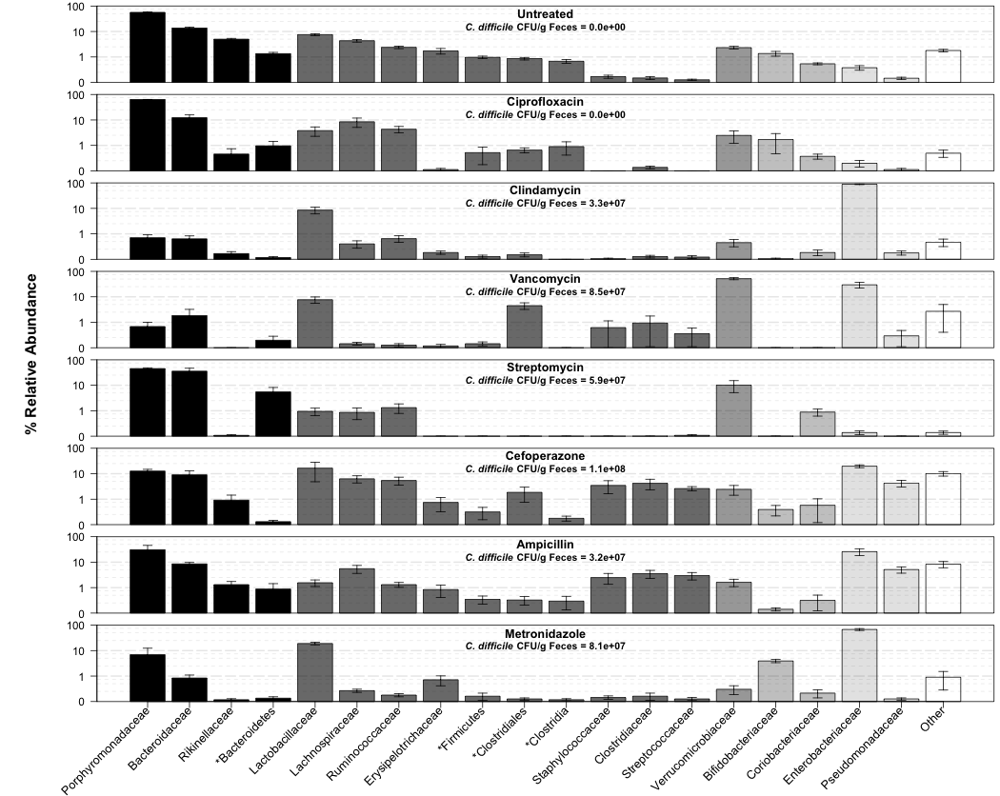
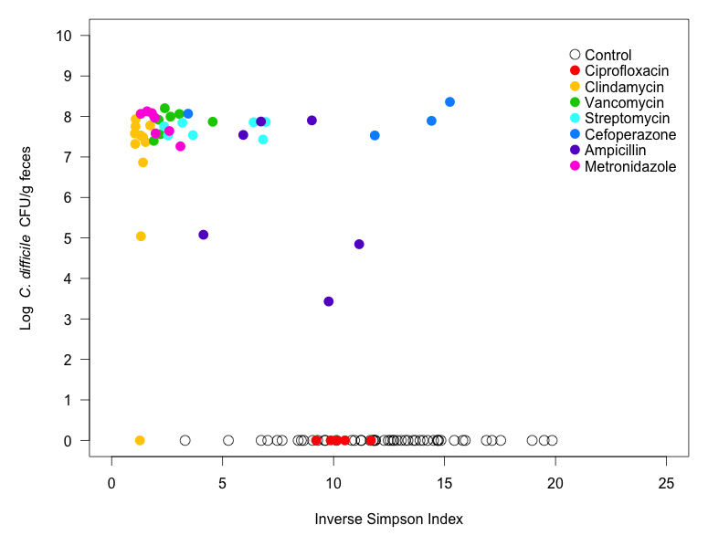
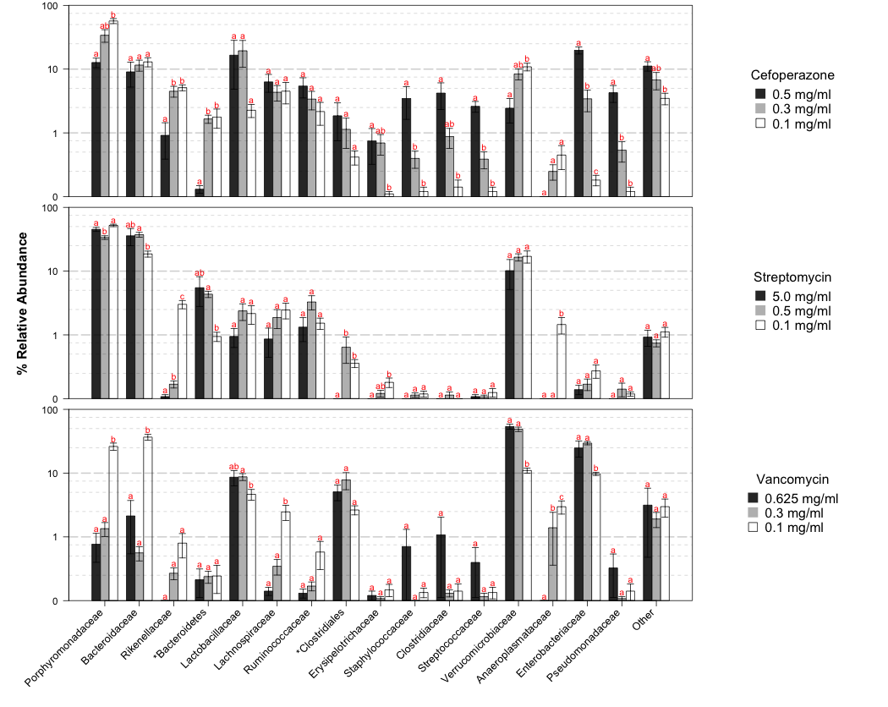

> Note: The text in block code such as this are not in the original paper. They are there to provide an explanation of the R code and results.
>
>


**Running title:** Antibiotic induced alterations of the murine gut microbiota and subsequent effects on colonization resistance against *Clostridium difficile*

**Short title:** Alterations of the Murine Gut Microbiota that Lead to Clostridium difficile Colonization

Alyxandria M. Schubert<sup>1</sup>, Hamide Sinani<sup>1</sup>, and Patrick D.
Schloss<sup>1</sup>\*

&nbsp;&nbsp;&nbsp;&nbsp;&nbsp;\* Correspondence: <pschloss@umich.edu>

&nbsp;&nbsp;&nbsp;&nbsp;&nbsp;734.647.5801

&nbsp;&nbsp;&nbsp;&nbsp;&nbsp;Department of Microbiology and Immunology

&nbsp;&nbsp;&nbsp;&nbsp;&nbsp;University of Michigan

&nbsp;&nbsp;&nbsp;&nbsp;&nbsp;5618 Medical Sciences II

&nbsp;&nbsp;&nbsp;&nbsp;&nbsp;1500 W. Medical Center Dr.

&nbsp;&nbsp;&nbsp;&nbsp;&nbsp;Ann Arbor, MI 48109

1 Department of Microbiology and Immunology, 1500 W. Medical Center,
University of Michigan, Ann Arbor, MI 48109

### Abstract


### Introduction

The microbiome, or the diverse community of microorganisms living in and on the body, has an integral role in deterring pathogen colonization and infection. This native protection by the microbiome from invasive pathogenic species is termed colonization resistance. It is well established that the gut bacterial microbiome is critical in the hosts’ defense against the pathogen Clostridium difficile. When this indigenous community is perturbed, this often leads to a loss of resistance. This is especially important in many hospital settings where patients are not only exposed to various types and degrees of perturbations, such as antibiotics, diet changes, chemotherapy, but also exposed to the environmental *C. difficile* spores. Among hospital-acquired infections in the United States, *C. difficile* infections (CDI) are the number one reported and are responsible for 14,000 deaths a year. It is not completely understood how different perturbations affect subsequent colonization resistance, nor do we have a comprehensive view of the taxonomic changes associated with a loss in colonization resistance.

There is a need for more knowledge about interactions between members of the community. Know that fmts work [anna’s paper], but don’t know why, except that you recover the diversity and are receiving an established community already that works. Individual probiotics have not worked with complete success [dendukuri 2005], whereas studies find that combinations of bacteria often work better than by themselves [lawley, pamer, stein, hickson 2007]. It’s also common for bacteria to change their behavior in the context of other bacterial species [Crost 2010, quorum sensing-biofilms, recognizing fellow bacterial species vs killing others, synergistic effects (sieuwerts 2010)]. Understanding the scope of relationships between bacteria in a community is necessary to learn about its response, in concert with its host, to perturbations including antibiotic-induced, pathogen invasion, probiotics doses, and diet changes, etc. 

The purest way of studying these bacterial interactions is by characterizing them in the context of their whole biome [ecology citation?]. [examples of papers showing microbiomes response to antibiotics in the context of CR]

These observed changes in response to perturbation can be used to inform models and networks to predict future responses (stein, Gordon diet paper) and characterize bacterial interactions (psoriasis/Schubert, sparCC paper). These methods are advantageous in that they can be refined to determine probiotic prophylactics or treatments based on an individual patient’s gut microbial needs.  

The purpose of this investigation was to test the effects of an array of perturbations on microbiome CR levels against *C. difficile*.  We then used this information to design microbiome-based models for estimating pathogen colonization levels. Through the administration of various antibiotic regimens, we altered the murine gut microbiota and observed these changes using 16S rRNA sequencing. The resultant gut communities were then challenged with *C. difficile* spores. Through correlation and random forest analysis of the starting communities with the subsequent level of *C. difficile* colonization, we built linear models to predict *C. difficile* colonization levels based on a subset of the microbiota. We used experimental data to test the ability of the model. 

Though we are limited in a resolution at the strain and species level, we have identified groups of related species with antagonistic relationships with *C. difficile* colonization. We identified several models with equally robust quality statistics and observed that across the top models a subset of 5 species were consistently present. These findings __


### Materials and Methods

***Animal Care.*** We used 5-8 week old C57Bl/6 mice for all our experiments. These mice were housed in our SPF room in the animal facility at the University of Michigan. All animal-related protocols and experiments were approved by the University Committee on Use and Care of Animals at the University of Michigan. 

***Antibiotic Administration.*** Mice were administered one of seven different antibiotics, including cefoperazone, vancomycin, metronidazole, streptomycin, ciprofloxacin, ampicillin, and clindamycin. The route of administration depended on the specific antibiotic. Cefoperazone (either 0.5mg/ml, 0.3mg/ml, or 0.1mg/ml), vancomycin (0.625mg/ml, 0.3mg/ml, or 0.1mg/ml), streptomycin (5mg/ml, 0.5mg/ml, or 0.1mg/ml), metronidazole (0.5mg/ml), and ampicillin (0.5mg/ml) were all administered in the mouse drinking water for 5 days. Ciprofloxacin (10 mg/kg) was administered via oral gavage, and clindamycin (10 mg/kg) was administered via IP injection. All antibiotic treated mice were given 24 hours of recovery on regular drinking water prior to *C. difficile* challenge. 

***C. difficile Preparation and Challenge*** In all our experiments we used *C. difficile* strain 630Δerm [cite dena lyras]. The spores used were prepared from a single large batch made following previously established protocols [cite paul?]. Spores were quantified within the week prior to *C. difficile* challenge for each experiment [established protocol I can cite?]. Spores were quantified by boiling a small volume at 65°C for 20 minutes to kill off residual vegetative cells. The volume was then diluted and plated on TCCFA plates. These were incubated at 37°C anaerobically overnight. The next day *C. difficile* colony forming units (CFU) were counted and the concentration of spores in the working stock was back calculated. On the day of challenge, *C. difficile* spores, at a final concentration of 103, were administered to mice via oral gavage. Immediately following this challenge, the remaining *C. difficile* inoculum was diluted in a series and plated to confirm the correct dosage. 

***Sample Collection and Plating*** Fecal samples were freshly collected for each mouse immediately prior to the administration of any antibiotic, during any antibiotic recovery days, and days 0 and 1 post *C. difficile* challenge. Each fecal sample on day 1 was weighed and diluted under anaerobic conditions with anaerobic PBS 1:10 based on pellet weight. A dilution series was then plated onto TCCFA plates [cite plates] and incubated at 37°C anaerobically overnight. The colony forming units (CFU) were counted and calculated the subsequent day. 

***DNA Extraction and Sequencing*** Total bacterial DNA was extracted from each untreated and day 0 stool sample using the MOBIO PowerSoil®-htp 96 Well Soil DNA Isolation Kit. Sequencing preparation and sequencing was carried out as previously described (Kozich JJ et al. 2013). Briefly, the V4 region of the 16S rRNA gene was amplified, purified, and pooled in equimolar concentrations. These libraries were then mixed with Illumina-prepared PhiX control libraries. Sequencing was performed using Illumina’s MiSeq platform to produce paired 250-nt reads. Mock/error/error of run?

***Sequence Curation*** These sequences were curated using mothur as previously described (Kozich JJ et al and Schloss PD et al). The full pipeline is also demonstrated online at the mother website (http://www.mothur.org/wiki/MiSeq_SOP). Sequences were binned into operational taxonomic units (OTUs) using a 3% dissimilarity cutoff. Taxonomic assignments were determined by using a naïve Bayesian classifier with the Ribosomal Database Project (RDP) training set (version 9) requiring an 80% bootstrap confidence score. In order to avoid biases due to uneven sampling, samples were normalized to 1,625 sequences per samples [Schloss, reducing effects]. For those samples with more than 1,625 sequences per samples, the range was __, the mean was __, the median was __, the median absolute deviation was __. All 16S rRNA gene sequence data and the MIMARKS table are available at __. 

***Statistical Analysis & Modeling*** Across all data, we set a relative abundance threshold of an average of 1% in at least one experimental group. The 44 OTUs that met this cutoff were included in the training of the model. We used the "randomForest" package in R to build a regression-based random forest model to predict *C. difficile* colonization levels on day 1 based on the microbiome data from day 0. All statistical analyses were conducted using R version 3.1.2. 


### Results

***Levels of colonization resistance are associated with the initial structure of the gut microbiota.*** In mouse models of CDI, the baseline, untreated murine microbiota is completely resistant to *C. difficile* colonization. It was previously shown that C57Bl/6 mice treated with cefoperazone [], clindamycin [], or clindamycin in combination with a five antibiotic cocktail [] all have decreased resistance against this pathogen. To further characterize structural shifts in the microbiota associated with this loss of protective function, we chose a panel of seven representatives from six classes of antibiotics (**Table 1**) to differentially alter the microbiota and assess their resistance to *C. difficile* colonization. 16S rRNA gene sequencing of the fecal communities sampled at the time of *C. difficile* inoculation revealed distinct and reproducible microbiota structures (**Figure 1**). The community structures of the beta-lactam-treated mice (i.e. cefoperazone and ampicillin) were not significantly different from each other (AMOVA, p=0.-36). Clindamycin-treated microbiotas were significantly different from all other treatment groups (AMOVA, p=0.001) and were characterized by the predominance of *Enterobacteriaceae*. Of all groups significantly different from the untreated microbiota, the levels of *Enterobacteriaceae* increased with all treatments except with streptomycin. Vancomycin-treated communities saw the largest bloom in *Akkermansia*. In addition, the ciprofloxacin-treated microbiota were the only group that was not significantly different from untreated mice (AMOVA, p=0.09). Subsequently, 24 hours after inoculation *C. difficile* was undetectable in the untreated mice or the ciprofloxacin-treated mice; however it had successfully colonized the mice in all other treatment groups to similarly high levels (10<sup>7</sup>-10<sup>8</sup> CFU/g) (**Figure 1**). We calculated the diversity of all of the communities using the Inverse Simpson (**Supplemental Figure 1**) and Shannon indices (data not shown) and observed a significant negative correlation with subsequent *C. difficile* colonization (both p<0.001). These results suggest that multiple microbiota structures are capable of being colonized by *C. difficile* and that diversity may be an important factor in resistance to invasion.

--------



**Figure 1. Microbiota structures following diverse antibiotic treatments.** This figure shows the average percent relative abundances for family level phylotypes found in each experimental group on the day of *C. difficile* challenge. Each row depicts a different antibiotic perturbation. The level *C. difficile* colonization found 24 hours post microbiota sampling is plotted in the top right corner. Each represented phylum is a different shade of gray. Error bars depict standard error of the mean. 

--------



**Supplemental Figure 1. Diversity is nevatively correlated with *C. difficile* levels.** This figure shows the relationship between the inverse simpson diversity index of microbiotas of each experimental group on day 0 and *C. difficile* CFU/g feces on day 1. Spearman's rho is plotted in the top right corner. 

--------

> ### CFU stats comparison
> To compare CFU levels: 

```{r, eval=TRUE}

file<-read.csv("~/Documents/Github/abxD01/Figure1/abxD01.final.tx.1.subsample.relabund.topdose2.forlogscale.csv", header=T)

data <- file[ which(file$expgroup != '1untr'), ] #choose experimental groups
data$nextDayCFU<-log10(data$nextDayCFU+1) #log transform CFUs
anova(lm(data$nextDayCFU ~ data$expgroup)) #perform anova across experimental groups for CFU

#Which groups are different? Ciprofloxacin was clearly lower
data <- data[ which(data$expgroup != '2cipro'), ] #remove ciprofloxacin to see now if there's a difference in remaining groups
anova(lm(data$nextDayCFU ~ data$expgroup)) 
              
```

> ### Amova to compare resulting community structures
> Amova calculation in mothur to determine the uniqueness of each community structure:
>

```
dist.shared(shared=abxD01.final.an.unique_list.0.03.topdose2.shared, calc=thetayc-jclass, subsample=1625)
amova(phylip=abxD01.final.an.unique_list.0.03.topdose2.thetayc.0.03.lt.ave.dist, design=topdose_design_byABX.txt, iters=1000000)

```
> This results in the file called "abxD01.final.an.unique_list.0.03.topdose2.thetayc.0.03.lt.ave.amova" located in the github folder. The results of these are summarized in "amova8expgroups.xlsx".
> 
> ### Figure 1: Bargraph
> 
> This figure was built using the R script called "stacked.barcharts.r", which contains the stackedbarcharts() funciton in the abxD01 folder.The input files are listed in Github. The graph can be sorted 2 ways either by the untreated's decreasing relabund (sortbyphyl=FALSE), or by the most abundant within each phylum (sortbyphyl=TRUE). For each treatment, the resulting *C. difficile* CFU/g Feces is also labeled on the Y axis below the treatment name. 
> The parameters I changed in the r script were:

```{r, eval=FALSE, warning=FALSE}
abx<-c("Untreated", "Ciprofloxacin", "Clindamycin", "Vancomycin", "Streptomycin", "Cefoperazone", "Ampicillin", "Metronidazole")

library(Hmisc)
stackedbarcharts(file="~/Documents/Github/abxD01/Figure1/abxD01.final.tx.2.subsample.relabund.topdose2.forlogscale.csv", fileIDS = "~/Documents/Github/abxD01/Figure1/topdose_tx2_barchart_ids.csv", graphLabels = abx, sortbyphyl = TRUE, graphbyphyl = FALSE)

```

> Files saved as "topdose2_tx1_sorted_10x20.pdf" and "topdose2_tx2_sorted_10x20.pdf".
> 
> ### Supplemental Figure 1: correlation plot of diversity with *C. difficile*
> 
> For the correlation calculations see the next section of the results.
> Figure making:

```
# In mothur:
summary.single(calc=invsimpson-shannon, shared=abxD01.final.an.unique_list.shared, subsample=1625)

```
> Using these results, I selected the samples within the original antibiotic set.  Then I calculated the spearman correlation of *C. difficile* CFU/g feces on day 1 with the level of diversity found in the community on day 0 (day of challenge). Both inverse simpson and shannon indices were included. 


```{r, eval=FALSE}

diversity<-read.csv("~/Documents/Github/abxD01/supplemental/topdose_diversity.csv",  header=T)
diversity$nextDayCFU <- log((diversity$nextDayCFU+1), 10)

#correlation of top dose
pval.spear <- c()
cor.spear <- c()
count <- 1
for(i in 4:5){
  cor.spear[count] <- cor.test(diversity[,3],diversity[,i], method="spearman")$estimate
  pval.spear[count] <- cor.test(diversity[,3],diversity[,i], method="spearman")$p.value
  count <- count + 1 
}
corr.results <- as.matrix(cbind(cor.spear, pval.spear))
rownames(corr.results) <- names(diversity)[4:5]

# Plot inverse simpson vs. C. difficile levels
color<-rainbow(7)
colors.top <- c(control = "black",
          cipro = color[1],
          clinda = "#FFCC00",
          vanc.625 = "#00CC00",
          strep5 = "#33FFFF",
          cef.5 = color[5],
          amp.5 = "#6600FF",
          metro1 = color[7])

# shapes
pch.top <- c(control = 1,
         cipro = 16,
         clinda = 16,
         vanc.625 = 16,
         strep5 = 16,
         cef.5 = 16,
         amp.5 = 16,
         metro1 = 16)

#these are needed for the legend
legend.labels.top <- c(control = "Control",
            cipro = "Ciprofloxacin",
            clinda = "Clindamycin",
            vanc.625 = "Vancomycin",
            strep5 = "Streptomycin",
            cef.5 = "Cefoperazone",
            amp.5 = "Ampicillin",
            metro1 = "Metronidazole")

par(mar=c(5, 5, 1, 1) +0.1, mgp=c(3, 1, 0)) 
par(mfrow=c(1,1))

plot(diversity$invsimpson[diversity$expgroup=="control"], 
     diversity$nextDayCFU[diversity$expgroup=="control"], 
     pch=pch.top[1], col=colors.top[1], xlim=c(0, 25), ylim=c(0,10),  
     cex=1.5, yaxt="n",  xaxt="n", cex.lab=1,
     ylab=as.expression("Log " ~ italic("C. difficile") ~ " CFU/g feces"), xlab="Inverse Simpson Index")

axis(1, las=1, cex.axis=1, at=seq(0,25, by=5))
axis(2, las=1, cex.axis=1, at=seq(0,10, by=1))

for(i in 2:(length(unique(diversity$expgroup)))){
  points(diversity$invsimpson[diversity$expgroup==names(legend.labels.top)[i]],
         diversity$nextDayCFU[diversity$expgroup==names(legend.labels.top)[i]], 
         pch=pch.top[i], col=colors.top[i], cex=1.5)
}

legend("topright", inset=0.05, legend=legend.labels.top, pch=pch.top, col=colors.top,  pt.cex=1.5, cex=1, bty="n", y.intersp=1.5)

```


--------

***Correlation analysis reveals potentially protective bacteria.*** To identify bacterial taxa that could be associated with resistance or susceptibility to *C. difficile*, we measured the correlation between the relative abundance of each species-level OTU on the day of inoculation with the level of *C. difficile* colonization 24 hours later across all treatment groups (Figure 2). Of the significant OTUs (p<0.05) with an average abundance greater than 0.1%, OTUs with negative a correlation were associated with providing resistance against *C. difficile* (N=40) and those with a positive correlation were associated with susceptibility (N=7). Among various bacterial families, three were consistently negatively correlated with *C. difficile* colonization: *Porphyromonadaceae* (ρaverage= -0.63), *Lachnospiraceae* (ρaverage= -0.51), *Ruminococcaceae* (ρaverage= -0.53). OTUs from the *Proteobacteria* phylum had strong positive relationships with *C. difficile* colonization. These included OTUs associated with the *Pseudomonas* (ρ= 0.31) and *Escherichia* (ρ= 0.56) genera. Other notable OTUs that were found at the extremes of the distribution of correlation scores included those affiliated with the genus *Lactobacillus* (family *Lactobacillaceae*; OTU23, ρ= -0.73), *Alistipes* (family *Rickenellaceae*; OTU20, ρ= -0.78), *Enterorhabdus* (phylum *Actinobacterium*, family *Coriobacteriaceae*; OTU29, ρ= -0.70), and *Streptococcus* (family *Streptococcaceae*; OTU78, ρ= 0.36). Overall, these results suggest that several larger groups of related OTUs, particularly within the *Firmicutes* and *Bacteroidetes* phyla, may participate in colonization resistance against *C. difficile*, while members of the *Proteobacteria* phylum may be involved in susceptibility.

--------


**Figure 2. Broader taxonomic groups share similar relationships with *C. difficile*.** Species level OTUs (3% cutoff) found on day 0 were correlated with the level of *C. difficile* CFU/g feces on day 1 using Spearman’s rank based correlation coefficient. Only OTUs with an average abundance of at least 0.05% across all original treatments were considered in the correlation analysis. All correlations shown in this graph are significant (p<0.05). OTUs were grouped by family. Asterisk * indicates unclassified at family level.

--------

> ### Correlation Calculations
> 
> The required file is located on Github.

```{r, eval=TRUE, warning=FALSE}

meta <- read.table('~/Documents/Github/abxD01/Figure2/abxD01.final.an.unique_list.0.03.subsample.filter16mintotal.shared.correl.topdose2.txt',header=T)
#meta<-meta[1:96] #change based on number of OTUs above .05%, then add 2 for first two cols
c<-1
otu <- c()
cor.spear <- c()
pval.spear <- c()
cor.ken = c()
pval.ken = c()
for(i in 3:length(meta)){
  otu[c] <- colnames(meta[i])
  cor.spear[c] <- cor.test(meta[,2],meta[,i], method="spearman")$estimate
  pval.spear[c] <- cor.test(meta[,2],meta[,i], method="spearman")$p.value
  cor.ken[c] <- cor.test(meta[,2],meta[,i], method="kendall")$estimate #good to see because kendall handles ties
  pval.ken[c] <- cor.test(meta[,2],meta[,i], method="kendall")$p.value #but only works if this is tao-b and not tao-a which im not sure about
  c <- c+1
}

pval.spear<-p.adjust(pval.spear, method='BH') #adjust for multiple comparisons
pval.ken<-p.adjust(pval.ken, method='BH') #adjust for multiple comparisons

results = NULL
results <- matrix(c(otu, cor.spear, pval.spear, cor.ken, pval.ken), ncol=5)
colnames(results) <- c('otu','corSpear','pvalSpear', "corKen", "pvalKen")
results <- results[order(results[,3]),]  #order by pvalue column=3
#write.table(results[1:dim(results)[1],], file="~/Documents/Github/abxD01/Figure2/abxD01.final.an.unique_list.0.03.subsample.filter16mintotal.shared.correl.topdose2.results.txt", sep="\t", row.names=FALSE)
print(results[1:dim(results)[1],])

```

> ### Figure 2: Stipchart
> 
> This figure shows the correlation analysis of bacterial species present on Day 0 with *C. difficile* levels on Day 1 using the original set of antibiotic groups. 
> 
> Necessary files are on github, and it was made using the following code: 

```{r, eval=FALSE}

##Paper Figure: correlations for topdose 
otuCorrs<-read.csv("~/Documents/Github/abxD01/Figure2/corr_avgAbove0.001_topdose2_stripchart.csv", header=T)

pch <- c(6,6,6,6, 1,1, 1, 1, 1, 1, 1, 1,0, 0, 9, 2, 2, 4)
par(mar=c(8, 6, 2, 2) +0.1, mgp=c(4, 1, 0)) #default is 5.1 4.1 4.1 2.1 [bottom, left, top, right space], mgp=c(3, 1, 0) [label line location for x/y location labels, tick mark labels location, tick mark locations]
stripchart(otuCorrs$corr ~ otuCorrs$graphOrder, vertical=TRUE, ylab="Spearman Correlation", ylim=c(-1, 1), cex.axis=1, cex=2, pch=pch, lwd=2, col="black",  method="jitter",  jitter=.2, cex.lab=1.1, yaxt="n", xaxt="n")
axis(1, cex.axis=1, at=(1:nlevels(otuCorrs$family)), labels=FALSE)
family.labels <- unique(otuCorrs[order(otuCorrs$graphOrder), "family"])
text(1:nlevels(otuCorrs$family)+.3, par("usr")[3]-0.05, label=(family.labels), xpd=NA, pos=2, srt=45, cex=1)
axis(2, cex.axis=1, at=seq(-1,+1, by=.1), las=1)
color_transparent <- adjustcolor("black", alpha.f = 0.3) 
abline(v=c(1:nlevels(otuCorrs$family)), col=color_transparent)
abline(h=0, col="dark gray", lwd=2)
abline(h=c(0.25, 0.5, 0.75, -0.25, -0.5, -0.75), col=color_transparent, lwd=2, lty="dashed")
phylum.labels <- unique(otuCorrs[order(otuCorrs$graphOrder), "phyl"])
leg<-legend("top",  legend=phylum.labels, pch=c(6, 1, 0, 9, 2, 4), cex=1, bty="o", horiz=TRUE, pt.cex=1, text.width=2.5)

```

> Figure saved as "corr_avgAbove0.001_topdose2_10x10.pdf".

***Smaller perturbations of the microbiota result in maintenance of colonization resistance.*** <transition>
Because most of our original treatments resulted in similarly high levels of *C. difficile*, we hypothesized that applying smaller antibiotic perturbations to the microbiota would result in reduced sensitivity to *C. difficile*, as we observed in the ciprofloxacin treated mice. To test this, we titrated the doses of cefoperazone, streptomycin, and vancomycin given to mice (Supplemental Table 1). Colonization levels decreased significantly in all mice receiving titrated doses in support of our hypothesis. *C. difficile* levels were significantly different between all titration groups within the cefoperazone (p<0.03) and streptomycin treated microbiotas (p<0.01), displaying a greater range of colonization resistance profiles (Figure 3). Next, we hypothesized that the populations we previously identified as being associated with protection against colonization would be elevated in the mice with decreased colonization and those associated with susceptibility would be less abundant.

The titrated antibiotic doses clearly resulted in distinct community structures that were variations of the original dose (Figure 3). The cefoperazone titrations resulted in a shift in dominance from the *Bacteroidetes* to the *Firmicutes* phylum with increasing antibiotic dose. Most notable was the increase in OTUs associated with resistance including the *Porphyromonadaceae* and *Alistipes* and a reduction in OTUs associated with susceptibility including members of the *Proteobacteria*, *Clostridium*, and *Staphylococcus*. The relative abundance of other OTUs associated with protection including the *Lactobacillus*, *Lachnospiraceae*, and *Ruminococcaceae* did not change as expected based on the initial correlation analysis; however, these OTUs were present at levels similar to the untreated mice. The streptomycin titrations did not result in profound shifts in the overall community structure, but did yield increased resistance. Rather, there were individual populations that were gained or lost across the gradient. Notably, mice receiving the lowest dose retained significantly higher levels of *Alistipes* and *Anaeroplasma* (p<0.05), which we previously found to be strongly associated with colonization resistance. The relative abundances of the *Porphyromonodaceae*, *Lachnospiraceae*, *Ruminococcaceae* were unchanged, but were present at similarly high levels to those found in the untreated mice. Although the vancomycin titration yielded a number of large changes in the abundance of individual populations, there was no recovery of colonization resistance. The relative abundance of many of the populations associated with resistance (*Porphyromonadaceae*, *Lachnospiraceae*, *Anaeroplasma*) increased with decreased vancomycin dosage; however, with the exception of the *Lactobacillus* populations, they did not reach the levels observed in the untreated mice. In addition, all of the vancomycin-treated mice had high levels of OTUs affiliated with the *Akkermansia* and *Enterobacteriaceae*. Together, these results suggest that individual populations are not sufficient to provide colonization resistance. Rather, resistance is likely a product of the overall composition of the community.

--------



**Figure 3. TITLE.** This figure shows the average percent relative abundances for family level phylotypes found on the day of *C. difficile* challenge in each titration group. Each row depicts a different antibiotic that was titrated. High, medium, and low antibiotic doses are represented by black, grey, and white colored bars respectively. The specific dose amount is shown for each antibiotic. Error bars show the standard error of the mean. 

--------

> ### CFU stats comparison
> 
> For comparison of the CFU's among titration groups: 

```{r, eval=TRUE}
file<-read.csv("~/Documents/Github/abxD01/Figure3/abxD01.final.tx2.subsample.alltitrations.forlogscale.csv", header=T)
file<-file[!grepl("untr", file$expgroup),]
file$nextDayCFU <- log10(file$nextDayCFU+1)

cef <- file[file$abx=="Cefoperazone", 3:4]
strep <- file[file$abx=="Streptomycin", 3:4]
vanc <- file[file$abx=="Vancomycin", 3:4]

diffs <- function(data){
  data.aov<-aov(data$nextDayCFU ~ data$expgroup)
  anova(data.aov)
  pairwise.t.test(data$nextDayCFU, data$expgroup, p.adjust="BH")
}

diffs(cef)
diffs(strep)
diffs(vanc)

```

> ### Figure 3: Barchart
> 
> This figure shows the effect of titrating antibiotics on the community as well as the resulting *C. difficile* levels.  
> 
> The file/fileIDS should be matched by the titration.
> Input files on github:
> 1. abxD01.final.tx.2.subsample.alltitrations.forlogscale.csv
> 2. alltitrations_tx2_barchart_ids.csv
> 
> Uses functions in R scripts folder: stacked.barcharts.r, findStatLetters.r, barplotBeside.r

```{r, eval=FALSE}

stackedbarcharts(file = "~/Documents/Github/abxD01/Figure3/abxD01.final.tx2.subsample.alltitrations.forlogscale.csv", fileIDS = "~/Documents/Github/abxD01/Figure3/alltitrations_tx2_barchart_ids.csv", excludeGroup="untr", divide = TRUE)

```

***Allowing recovery of specific bacteria restores colonization resistance.*** Several antibiotic perturbation studies have demonstrated that given time perturbed communities can return to a “healthy” state in which resistance to *C. difficile* is restored []. For each antibiotic treatment, a control group of mice receiving antibiotics without inoculation of *C. difficile* was maintained. The microbiota’s of animals treated with metronidazole underwent a drastic shift in the microbiota structure with an additional 5 days of recovery. We observed changes in relative abundance of several OTUs that we previously observed had strong relationships with subsequent *C. difficile* colonization (Figure 2). Notably there were significant increases (p<0.05) in overall abundance of the levels of *Porphyromonadaceae*, *Ruminococcaceae*, and *Lachnospiraceae* to levels similar to untreated microbiota, and significant decreases (p<0.05) in levels of *Enterobacteriaceae*. Based on these changes, we hypothesized that delaying *C. difficile* challenge to allow these potentially important changes in microbiota structure to occur would lead to a decrease in colonization. On Day 1 post challenge of these recovered mice, we observed a significant decrease in *C. difficile* level of CFU/g feces (p<0.0001). These results strengthen the importance of *Porphyromonadaceae*, *Lachnospiraceae*, *Ruminococcaceae*, and *Enterobacteriaceae* in setting up the right environment of negatively and positively correlated bacteria to affect the outcome of *C. difficile* colonization. 

Additionally, we assessed the resistance of ampicillin treated mice given five extra days of recovery prior to *C. difficile* challenge. The shift in the microbiome with ampicillin recovery was not as prounounced as seen with recovery of metronidazole treated animals. These communities had significantly reduced levels of bacteria correlated with *C. difficile* protection, including *Bacteroides*, *Alistipes*, and *Ruminoccocaceae* compared with untreated animals (p<0.05). Importantly, the level of *Enterobacteriaceae* was not significantly reduced with additional recovery time. Given the smaller changes towards a protective baseline state, it was not all that surprising that we were unable to detect significant changes in subsequent *C. difficile* levels (p=0.12). 

--------


**Figure 4. TITLE.** This figure shows the average percent relative abundances for family level phylotypes found on the day of *C. difficile* challenge in each experimental group. Each row depicts a different antibiotic that was allowed to recover. Black bars represent untreated animals. Grey bars represent animals given 1 day of recovery off antibiotics as in Figure 1. White bars represent animals given a total of 6 recovery days (5 additional days). Error bars show standard error of the mean.

--------


**Supplemental Figure 2. Structural distances between untreated and recovery days.** This figure shows the average theta YC distance between pretreatment and recovery days by antibiotic group. Day -11 represent untreated mice. Day 0 represents day of *C. difficile* challenge. Error bars show standard error of the mean.

--------

> ### Supplemental Figure 2: Differences between recovery days' thetayc
 
```{r, eval=FALSE}
file = "~/Desktop/mothur/abxD01/abxD01.final.an.unique_list.0.03.recovery.vancomycin.thetayc.0.03.lt.ave.dist"
diffs <- getDistDiffs(file=file)

metadata <- read.delim(file="~/Desktop/mothur/abxD01/searchme.txt", header = T, stringsAsFactors=F)
metadata$sample[1951] <- "007-1D1" # ID was messed up
names(metadata)[3] <- "group"

plot.dist.from(dist.from = diffs)

```

> ### Statistical comparison of delayed and on time CFU results

```{r, eval=TRUE}
file<-read.csv("~/Documents/Github/abxD01/Figure4/abxD01.final.tx2.subsample.alldelay.relabund.csv", header=T)
file<-file[file$expgroup!="1untr",]
file$nextDayCFU <- log10(file$nextDayCFU+1)

metro <- file[file$abx=="Metronidazole", 3:4]
amp <- file[file$abx=="Ampicillin", 3:4]

diffs <- function(data){
  data.aov<-aov(data$nextDayCFU ~ data$expgroup)
  print(anova(data.aov))
  pairwise.t.test(data$nextDayCFU, data$expgroup, p.adjust="BH")
}

diffs(metro)
diffs(amp)

```

> ### Figure 4: Barchart
> 
> This figure shows the difference between the Day 0's in the delayed and original treatments for metronidazole and ampicillin.
> 
> Input files on github folder Figure 5:
> 1. abxD01.final.tx.2.subsample.alldelay.forlogscale.csv
> 2. alldelay_tx2_barchart_ids.csv
> 
> Uses functions in R scripts folder: stacked.barcharts.r, findStatLetters.r, barplotBeside.r

```{r, eval=FALSE}

stackedbarcharts(file = "~/Documents/Github/abxD01/Figure4/abxD01.final.tx.2.subsample.alldelay.forlogscale.csv", fileIDS = "~/Documents/Github/abxD01/Figure4/alldelay_tx2_barchart_ids.csv", divide = TRUE)

```

***Modeling microbiota data can predict C. difficile colonization outcomes.*** Given our ability to make general predictions of *C. difficile* colonization based on the microbiota, we next designed a model to calculate expected colonization levels given the relative abundance of a subset of OTUs. Combining the three datasets (Table 1, Supplemental Table 1 and 2), we set a 1% relative abundance threshold, eliminating OTUs that on average were not present at this level in at least one of the 16 experimental groups. In total, there were 44 OTUs utilized for building a random forest regression model. This model fit the data with an R2 of 0.98 (Figure 5A). We identified OTUs that contributed most to increased accuracy of the model using random forest’s feature selection (Figure 5B). Many of the top contributing OTUs includes members of the *Porphyromonadaceae* family, *Alistipes*, *Lachnospiraceae*, *Lactobacillus*, and *Escherichia* taxa. The relationship between these OTUs and *C. difficile* is shown in Figure 5C. *Escherichia* had the largest positive correlation with *C. difficile* levels of any bacterial species.  This finding was consistent across susceptible antibiotic treated communities except for streptomycin treated communities, which altogether lacked *Enterobacteriaceae* spp. OTUs 3 and 39 (*Porphyromonadaceae* and *Lachnospiraceae*, respectively), were the two most important features in accurately predicting subsequent *C. difficile* levels. In fact, a model built with only these two features was able to account for 79% of the variance observed. Together these results suggest that colonization resistance is likely conferred by *porphyromonadaceae*, *Alistipes*, and *lachnospiraceae* and a loss in these bacteria, concurrently with a gain of *Escherichia*, can result in increased susceptibility to infection.  

--------


**Figure 5. Random forest model to predict *C. difficile* colonization levels based on the microbiota.** a) The fit of the random forest model by experimental group. The dashed line represents the y=x line. b) The 15 OTUs with the highest percent increase in mean squared error when dropped from the model. c) The percent relative abundance of the top 8 OTUs from (b) on day 0 are plotted against the log<sub>10</sub> *C. difficile* CFU/g feces.

--------

> ### Evaluating cutoffs for OTU inclusion in Random Forest model

```{r, eval=TRUE}
data<-read.csv("~/Desktop/mothur/abxD01/model/abxD01.final.an.unique_list.0.03.subsample.shared.toptitdel.noNewUntr.logtrans.filter16mintot.grouped.csv", header=T)

means <- as.data.frame(matrix(nrow=nlevels(data$expgroup), ncol=0))
row.names(means) <- levels(data$expgroup)
for(i in 3:length(data)){
  
  df <- aggregate( data[,i] ~ data$expgroup, data=data, mean )
  names(df)[2] <- names(data)[i]
  
  means <- as.data.frame(cbind( means, df[,2]))
  names(means)[dim(means)[2]] <- names(data)[i] 
}

means <- rbind(means, max=-1)
for(j in 1:length(means)){
  means["max", j] <- max(means[,j])
}

means <- rbind(means, relabund=-1)
for(k in 1:length(means)){
  means["relabund", k] <- (means[17,k])/1625
}

means <- rbind(means, percent=-1)
for(k in 1:length(means)){
  means["percent", k] <- (means[18,k])*100
}

meanOTU <- means[,-1] #remove the nextDayCFU column

set <- NULL
set <- seq(0,3, by=0.01)
numOTUxThreshold <- NULL
numOTUxThreshold <- as.data.frame(cbind(numOTUxThreshold, set))
names(numOTUxThreshold)[1] <- "threshold"
numOTUxThreshold <- cbind(numOTUxThreshold, numOTU=NA)
for( i in 1:(length(set)) ) {
  
  test <- meanOTU[ , meanOTU[19,] >= set[i] ]
  #test2 <- sum( meanOTU[19,] >= set[i] )
  
  numOTUxThreshold[i, 2] <- length(test)
  
}

plot(numOTUxThreshold$numOTU ~ numOTUxThreshold$threshold, xlab="Avg % RelAbund Threshold", ylab="# OTUs included")
abline(v=seq(0,3, by=.1), col="light gray")
abline(h=seq(1,300, by=10), col="light gray")
```

> This feeds into the next analysis section.
> 
> ### Random forest results

```{r, eval=TRUE}

otusAtPercAbund <- function(percThresh, meanOTU){
  perc <- meanOTU[ , meanOTU[19,] >= percThresh ]
  otus <- names(perc)[-(length(perc))]
  return(otus)
}

perc<-1
otus <- otusAtPercAbund(perc, meanOTU)

all <- read.csv(file=dataFile, header=T)
cols<- NULL
for(i in 1:(length(otus))){
  cols <-c(cols, which(names(all)==otus[i]))
}
cols <- c(which(names(all)=="Group"), which(names(all)=="nextDayCFU"), cols)

toptitdel <- all[,cols]
library(randomForest)

toptitdel.rf <- randomForest(nextDayCFU ~ ., 
                           data = toptitdel[,-1],  outscale=TRUE,
                           importance=TRUE, proximity=TRUE,
                           keep.forest=TRUE, ntree=5000
)
print(toptitdel.rf)
plot(toptitdel.rf)
varImpPlot(toptitdel.rf, type=1)
imp<-importance(toptitdel.rf)
imp1<-imp[order(imp[,1], decreasing = TRUE),]
topimp <- imp1[1:15,]
#write.table(topimp, file="~/Desktop/mothur/abxD01/rf/rf.toptitdel.1p.importance.txt", sep="\t", row.names=TRUE)

```

> ### Figure 5A: Evaluating and plotting the fit of the model

```{r, eval=FALSE}
predictions <- predict(toptitdel.rf, newdata=toptitdel[,-c(1,2)])
actual <- toptitdel$nextDayCFU
expgroup<- as.character(all[,2])
results<-as.data.frame(cbind(actual, predictions))
colnames(results) <- c( "actual", "predict")


ybar <- apply(results, 2, mean)
num<-sum((results$actual-ybar["actual"])*(results$predict-ybar["predict"]))
denA <- sum((results$actual-ybar["actual"])^2)
denB <- sum((results$predict-ybar["predict"])^2)
rsq <- (num^2)/(denA*denB) #calculated from the square of the sample correlation coefficient, little r squared as opposed to big R squared

results <- cbind(expgroup, results)

#Plot observed vs predicted
#information for plotting
color<-rainbow(7)
colors <- c(control = "black",
          cipro = color[1],
          clinda = "#FFCC00",
          vanc.625 = "#00CC00",
          vanc.3 = "#00CC00",
          vanc.1 = "#00CC00",
          strep5 = "#33FFFF",
          strep.5 = "#33FFFF",
          strep.1 = "#33FFFF",
          cef.5 = color[5],
          cef.3 = color[5],
          cef.1 = color[5],
          amp.5 = "#6600FF",
          amp.5d = "#6600FF",
          metro1 = color[7],
          metro1d = color[7])

# topdose is all circles, middle dose is square, 
# low dose is upward pointing triangle, delayed is starburst
pch <- c(control = 1,
         cipro = 16,
         clinda = 16,
         vanc.625 = 16,
         vanc.3 = 15,
         vanc.1 = 17,
         strep5 = 16,
         strep.5 = 15,
         strep.1 = 17,
         cef.5 = 16,
         cef.3 = 15,
         cef.1 = 17,
         amp.5 = 16,
         amp.5d = 8,
         metro1 = 16,
         metro1d = 8)

#these are needed for the legend
legend.labels <- c(control = "Control",
            cipro = "Ciprofloxacin",
            clinda = "Clindamycin",
            vanc.625 = "Vancomycin 0.625 mg/ml",
            vanc.3 = "Vancomycin 0.3 mg/ml",
            vanc.1 = "Vancomycin 0.1 mg/ml",
            strep5 = "Streptomycin 5 mg/ml",
            strep.5 = "Streptomycin 0.5 mg/ml",
            strep.1 = "Streptomycin 0.1 mg/ml",
            cef.5 = "Cefoperazone 0.5 mg/ml",
            cef.3 = "Cefoperazone 0.3 mg/ml",
            cef.1 = "Cefoperazone 0.1 mg/ml",
            amp.5 = "Ampicillin",
            amp.5d = "Ampicillin +5D",
            metro1 = "Metronidazole",
            metro1d = "Metronidazole +5D")

treatments <- c(control = "Control",
            cipro = "Ciprofloxacin",
            clinda = "Clindamycin",
            vanc.625 = "Vancomycin High",
            vanc.3 = "Vancomycin Medium",
            vanc.1 = "Vancomycin Low",
            strep5 = "Streptomycin High",
            strep.5 = "Streptomycin Medium",
            strep.1 = "Streptomycin Low",
            cef.5 = "Cefoperazone High",
            cef.3 = "Cefoperazone Medium",
            cef.1 = "Cefoperazone Low",
            amp.5 = "Ampicillin",
            amp.5d = "Ampicillin +5D",
            metro1 = "Metronidazole",
            metro1d = "Metronidazole +5D")

#par(mfrow=c(1,2))
design<-as.matrix(1:2)
design<-cbind(design, c(3,3))
layout(design, widths=c(1,1), heights=c(.3, 1))

plot.new()
par(mar=c(rep(0.5, 4)))
legend("bottom", legend=legend.labels, pch=pch, col=colors, pt.cex=1,  cex=1, bty="n", ncol = 2)

par(mar=c(5, 5, 0.5, 0.5) +0.1, mgp=c(3, 1, 0), las=1) #default is 5.1 4.1 4.1 2.1, bot/left/top/right, also default mgp is c(3,1,0)
plot(results[results[,1]=="control",2], 
     results[results[,1]=="control",3], 
     main="", 
     ylab=expression(paste("Predicted Log ", italic("C. difficile"), " CFU/g Feces")), 
     xlab=expression(paste("Actual Log ", italic("C. difficile"), " CFU/g Feces")), 
     ylim=c(0,9), xlim=c(0,9), xaxt='n', yaxt='n', cex=1.5)
#mtext(bquote("r"^"2" ~ " = " ~ .(signif(rsq, 3))), side=3, line=0)
abline(a=0, b=1, lty="dashed", lwd=2, col="black")
axis(1, at = c(0:9), labels=c(0:9))
axis(2, at = c(0:9), labels=c(0:9))

for(i in 2:(length(legend.labels))){
  points(results[results[,1]==names(legend.labels)[i],2], 
         results[results[,1]==names(legend.labels)[i],3], 
         col=colors[i], pch=pch[i], cex=1.5)
}

```

> ### Figure 5B: Importance Plot

```{r, eval=FALSE}
topimp<-topimp[order(topimp[,1], decreasing=FALSE),]
ids <- read.csv(file = "~/Documents/Github/abxD01/Figure5/rf.toptitdel.1p.importance.ids.csv", header = TRUE)
#par(mfrow=c(1, 1)) #+1 to give extra labeling space
par(mar=c(5, 15, 0.5, 1) +0.1, mgp=c(3, 1, 0), las=0) #default is 5.1 4.1 4.1 2.1, bot/left/top/right, also default mgp is c(3,1,0)
plot(topimp[,1], 1:15, xlab="% Increase in Mean Squared Error", yaxt="n", ylab="", pch=16, cex=1.5, xlim=c(20, 80))
axis(2, at = c(1:15), labels = rep("", 15), las=1, cex.axis=.9 )
for(z in 1:(dim(ids)[1])){
  name<-as.character(ids$name[z])
  otuname<- as.character(ids$otuname[z])
  mtext(text = bquote(italic(.(name))*" ("*.(otuname)*")"), at=z, side = 2, line = 1, las=2)
}
abline(h=c(1:15), lty="dashed", col='black')

```

> ### Testing a random forest model with only OTUs 3 and 39

```{r, eval=TRUE}
test3.39 <- toptitdel[,c("Group","nextDayCFU","Otu00003", "Otu00039")]

rf.test3.39 <- randomForest(nextDayCFU ~ ., 
                           data = test3.39[,-1],  outscale=TRUE,
                           importance=TRUE, proximity=TRUE,
                           keep.forest=TRUE, ntree=5000
)
print(rf.test3.39)
plot(rf.test3.39)

predictions <- predict(rf.test3.39, newdata=test3.39[,-c(1,2)])
actual <- test3.39$nextDayCFU
test.results<-as.data.frame(cbind(actual, predictions))
colnames(test.results) <- c( "actual", "predict")

ybar <- apply(test.results, 2, mean)
num<-sum((test.results$actual-ybar["actual"])*(test.results$predict-ybar["predict"]))
denA <- sum((test.results$actual-ybar["actual"])^2)
denB <- sum((test.results$predict-ybar["predict"])^2)
test.rsq <- (num^2)/(denA*denB)

```

> ### Correlation over all three datasets with *C. difficile* levels

```{r, eval=FALSE}

#First the correlation calculations that were put on the graph:
c<-1
otu <- c()
cor.spear <- c()
pval.spear <- c()
cor.ken <- c()
pval.ken <- c()
for(i in 3:length(toptitdel)){
  otu[c] <- colnames(toptitdel[i])
  cor.spear[c] <- cor.test(toptitdel[,2],toptitdel[,i], method="spearman")$estimate
  pval.spear[c] <- cor.test(toptitdel[,2],toptitdel[,i], method="spearman")$p.value
  cor.ken[c] <- cor.test(toptitdel[,2],toptitdel[,i], method="kendall")$estimate #good to see because kendall handles ties
  pval.ken[c] <- cor.test(toptitdel[,2],toptitdel[,i], method="kendall")$p.value #but only works if this is tao-b and not tao-a which im not sure about
  c <- c+1
}
pval.spear<-p.adjust(pval.spear, method='BH') #adjust for multiple comparisons
pval.ken<-p.adjust(pval.ken, method='BH') #adjust for multiple comparisons

results = NULL
results <- matrix(c(otu, cor.spear, pval.spear, cor.ken, pval.ken), ncol=5)
colnames(results) <- c('otu','corSpear','pvalSpear', "corKen", "pvalKen")
results <- results[order(results[,3]),]  #order by pvalue column=3
#write.table(results[1:dim(results)[1],], file="~/Desktop/mothur/abxD01/correlation/toptidel.1p.correl.txt", sep="\t", row.names=FALSE)
print(results[1:dim(results)[1],])
```

> From this file I selected the top 8 OTUs identified by random forest's increase in mean squared error measurement to graph (next section).
> 
> ### Figure 5C: OTU abundance vs. *C. difficile* abundance

```{r, eval=FALSE}
corrs<-read.csv(file="~/Desktop/mothur/abxD01/correlation/toptitdel.correlation.impOTUs.csv", header=TRUE)
corrs <- corrs[1:8,]
otunames <-  row.names(topimp)[15:8]
graphID <- ids[15:8,c(1,3)]

graphOTUxCD(otus = otunames, ids = graphID, corrs = corrs)
```


### Discussion

-community effect—have other things to compensate—highlight examples –streptomycin blue triangles—where low lachno but no cdiff so what else is protecting? Not one otu that explains it all… just cus low levels doesn’t screw you, also see recovered points in 5C-angela, sonnenburg-need other thingsssss
  -fig2—there are like larger groups in protection/susceptibility
	-combo of loss of good bugs, and gain of bad—a model of infection
-tie back to mbio paper, with enterobacteriaceae they are screwed
-modeling—not much done for CDI, link back to humans, shows we could model risk as they come in—put towards end with the larger picture
We designed statistical models based on a data set of varied antibiotic perturbations of the murine microbiota and their subsequent CR levels against *C. difficile*. Though antibiotic administration induced unique microbiota structures, colonization resistance was similarly low against *C. difficile*. 
These models incorporated all combinations of top candidate species-level OTUs. We then tested our top model’s ability to use new abundance information on a specific subset of the microbiota to predict the subsequent *C. difficile* colonization level, which was experimentally validated. These results greatly expand our knowledge of various perturbations and their subsequent effects on microbiota structure and function (colonization resistance ability). Furthermore modeling important/key bacterial subsets of the community we can build models to assess CDI risk.

Through our perturbation experiments we identified a panel of bacteria with either strong positive or negative relationships with subsequent levels of *C. difficile* colonization. A large number of Porphyromonadaceae, Lachnospiraceae, Ruminococcaceae, and Clostridia, as well as Alistipes were found to have strong potential resistance abilities against *C. difficile*. Conversely, several members of the Proteobacteria phylum, including Pseudomonas, Streptococcus, and especially E. coli have strong potential positive impacts for *C. difficile* colonization. These results were supported by their strong correlation values supported across several antibiotic regimens. They are also supported through experiments in which the original doses of cefoperazone, streptomycin, and (vancomycin) were titrated to alter the overall abundances but not membership of the community from the starting dose, as has been observed previously (Sekirov). These subtler structural changes allowed for greater range of colonization levels of *C. difficile* as well as further/fine-tuned support for our original results. Furthermore, by allowing a known change to occur in important bacterial populations within metronidazole treated mice, we were able to reduce the level of colonization by *C. difficile*. Lastly we showed their importance through modeling techniques that statistically confirm these results. 

Previous work characterizing the microbiome’s of human and mouse hosts in the context of CDI provide glimpses into potentially protective and alternatively susceptible community structures, i.e. which bacteria are present and their abundance. Cross-sectional investigations have characterized the microbiota of patients in the hospital with and without a *C. difficile* infection (CDI) and compared to healthy controls. These studies found patients with *C. difficile* tended to have a reduction in numbers of Clostridiales Incertae Sedis XI (Vincent et al), Lachnospiraceae, Ruminococcaceae, and Bacteroides (Schubert et al). These studies however lack the baseline healthy state of the microbiota, which preclude them from assessing risk of *C. difficile*. Murine models of CDI have the advantage of observing the specific changes that occur before and after controlled perturbations and the introduction of *C. difficile*. Communities with low levels of CR were associated with blooms in either Lactobacillaceae (cefoperazone-induced) (Theriot, 2014, bassis, 2014), Proteobacteria (induced by either clinda+5abx cocktail, clinda alone, or tigecycline) (Reeves, 2011, Buffie, 2011, Bassis 2014). Lachnospiraceae is associated with resistance to *C. difficile* infection (Reeves 2011) and has been directly shown to decrease colonization through mono-colonization studies in germfree mice (Reeves 2012).

Even fewer studies attempt to model these observational changes in the microbiome following perturbation. Using the time series data gathered from the *C. difficile* challenge of clindamycin-treated mice (Buffie 2011), a Lotka-Volterra dyamics-based framework was built which incorporates both time and accounts for external perturbations (Stein 2013). They identified a subset of their network, containing Blautia, Akkermansia, and Coprobacillus, as having a negative relationship with *C. difficile*, while alternatively Enterococcus had a positive relationship. 

------------------

o  How relates to other studies
•	Antonopoulos et al-reproducible community dynamics
•	Antunes et al (finlay)—abx treatment on intestinal metabalome
•	Sekirov—antibiotic induced perturbations of intestinal microbiota
•	 “Change in the compostion alone of the intestinal microbiota (in the absence of significant changes in total numbers of intestinal microbes) prior to Salmonella serovar Typhimurium infection was sufficient to make mice more susceptible to Salmonella serovar Typhimurium, indicating that different subsets of the microbiota may play protective roles or enhance susceptibility to enteric infections.”
•	Streptomycin and vancomycin doses were administered to mice prior to challenge with another gastrointestinal pathogen Salmonella enterica serovar Typhymurium (Sekirov 2008).  This study showed ___. Changes in community composition were dose dependent. 
•	Strep increases bacteroidetes (CFB), vanc increases firms and then proteo (with increasing dose)
•	Reeves/theriot/robinson—clindamycin/cef/cocktail/antbiotic administration alters the community structure
•	Croswell—prolonge impact of abx on intestinal microbial ecology salmonella
•	Rea- effect of  broad and narrow spectrum antimicrobials
•	Ferreira—intestinal microbiota plays a role in salmonella induced colitis
•	Reeves with clone libraries and cef
•	Theriot?—at least the metabolome paper—before and after with metabolites and cef, also does she look at anything taxonomically? yup

Many of the relationships we observed in our study between specific bacteria and *C. difficile* are supported in the literature. –see my comments in this section
Within the Porphyromonadaceae, only OTU505 had a significant positive relationship with subsequent *C. difficile* colonization (ρ= +0.21), which by blastn shares 99% identity with Coprobacter fastidiosus. Similarly within the Lachnospiraceae family, only one OTU had a positive relationship with *C. difficile* colonization (OTU174, ρ= +0.22). The Lachnospiraceae group also contained an OTU that had an exceptionally strong negative correlation (OTU39, ρ= +0.77). The Clostridia class was largely composed of the order Clostridiales (n=6), of which only one had a positive relationship with *C. difficile* colonization (OTU154, ρ= +0.26). 


Several broader groups of bacteria can work together (in some combination) to provide CR …possible that proteobacteria in general are bad …These results indicate that many related species within the larger/broader bacterial groups may be able to serve in providing colonization resistance against *C. difficile*.
Other taxons in Figure 3 had more species specific correlations. For instance the Actinobacteria phylum included Enterorhabdus (OTU29, ρ= -0.70), Coriobacteriaceae (OTU50, ρ= -0.50), Bifodbacterium (OTU22, ρ= -0.34), Actinomyces (OTU58, ρ= +0.23). The Lactobacillales group is divided into two negatively correlated Lactobacillus OTUs (OTUs 23, 21, ρ= -0.73, -0.40 respectively) and two positively correlated Streptococcus OTUs (OTUs 78, 79). Similarly, the Bacteroidales group included species at both extremes, for example, an Alistipes (OTU20, ρ= -0.78) and a Bacteroides species (OTU44, ρ= +0.34). [END sent, all the other bad bugs look more like random smaller level taxonomic classification divisions, as in it’s a genus/species level effect type deal] 
--functional redundancy? Across related large groups like porphyros?
--mostly Firmicutes—better competitors with cdiff? Because similar nutrients resources? 
Also functional redundancy with a highly diverse community… not just about who possibly but also ab being diverse—emphasizes community as a whole

OTU39—Eubacterium ventriosum (94%), eubacterium rectale (93%), roseburia intestinalis/hominis/faecis (93%) (positively correlated to differences observed in discordant MZ twins for BMI—more abundant in higher BMI siblings… these are all butyrate producers, also capable of degrading fiber)
	FOS—fructooligosaccharides produced by degredation of inulin or polyfructose

Inulin and fructo-oligosaccharides have divergent effects on colitis and commensal microbiota in HLA-B27 transgenic rats.
Abstract
Modulation of intestinal microbiota by non-digestible carbohydrates may reduce inflammation in inflammatory bowel disease (IBD). The aim of the present study was to assess the effects of inulin and fructo-oligosaccharides (FOS) on intestinal microbiota and colitis in HLA-B27 transgenic rats, a well-validated rodent model for IBD. In this study, 4-week-old rats were fed 8 g/kg body weight inulin or FOS for 12 weeks, or not. Faeces were collected at 4 and 16 weeks of age; and caecal samples were collected at necropsy. The effects of inulin and FOS on chronic intestinal inflammation were assessed using a gross gut score, histology score and levels of mucosal IL-1β. Intestinal microbiota were characterised by quantitative PCR and denaturing gradient gel electrophoresis. Colitis was significantly reduced in all FOS-fed rats compared to the control diet, whereas inulin decreased chronic intestinal inflammation in only half the number of animals. Quantitative analysis of caecal microbiota demonstrated that inulin increased the numbers of total bacteria and the Bacteroides-Prevotella-Porphyromonas group, FOS increased bifidobacteria, and both fructans decreased Clostridium cluster XI. In the faecal samples, both inulin and FOS decreased total bacteria, Bacteroides-Prevotella-Porphyromonas group, and Clostridium clusters XI and XIVa. FOS increased Bifidobacterium spp., and mediated a decrease of gene copies of Enterobacteriaceae and Clostridium difficile toxin B in faeces. SCFA concentrations in the faecal and caecal samples were unaffected by the diets. In conclusion, FOS increased the abundance of Bifidobacterium spp., whereas both fructans reduced Clostridium cluster XI and *C. difficile* toxin gene expression, correlating with a reduction of chronic intestinal inflammation.


Any interesting points about the results?  Mechanisms? Competition—ask matt if they are good?  Proteobacteria could definitely play a role in susceptibility—creating an environment fit for cdiff… what ways could all those other bugs be making a bad environment for cdiff? Using up bile acids/germinants..,  with those bugs gone freeing up sugars, … maybe connecting a lot more to some of caseys metabolome paper, and how mine would fit that

o	Limitations
•	No smaller intervals? Of cdiff levels, or changes in microbiota
•	Porphyromonadaceae is more prevalent in mice… so might not be as relevant for humans
•	Different strains of cdiff have different microbiota requirements to protect?
•	Doesn’t get at function… ?
•	Collect more data to continue to improve our microbiome modeling abilities, 


o	Contribution to the field, positive spins
•	PROBIOTICS
•	Possible global effects? CR against other GI pathogens?
•	clinical applications—PCR diagnostic for risk


The final paragraph should highlight the main conclusion(s), and provide some indication of the direction future research should take. (for and I and I mention host)
-therapeutic: continuously supply probiotics  while lowering inflammation of the host (get host side back to normal state in tandem, via drugs? diet)… so attack the issue of CDI from both the microbiota end and host end… microbiota-host-pathogen triangle… …squeeze it out (eg. clindamycin clearance? If compared pathology of host at diff days along 10d for clindamycin vs cef/met/amp (these other ones that are high in cdiff coloniz), is host or toxin diff?... why does clinda clear after being CDhigh but no other ABX?)


The human microbiome is complex; it has been observed that there is no identifiable “core” microbiome that all humans share (Turnbaugh 2009). It’s been observed that there is a high level of interindividual variation among healthy individuals’ microbiomes (Costello 2009). Thus the definition of a healthy microbiome is one that encompasses a wide range of microbiota structures, each one evolved with their host. It’s highly likely there is no one size fits all solution for the treatment or prevention of CDI. Thus characterizing the relationships within the microbiome are important in the context of a community. Need more studies that look at the level of the community as a whole in CR over the effect of single bugs.  Examples of papers looking at combinations/subsets of bacteria in CR


	It makes sense that many bacteria would play a role in colonization resistance and that it is more about the community composition as a whole given that interindividual differences is so great.  Two people share no more than __% of their microbiomes.  They are unique to individuals and yet all these different profiles of microbiotas are capable of colonization resistance.  People do not get *C. difficile* infections without first being exposed to some major purturbation of their microbiome, namely antibiotics.  Thus many structures of the microbiome, and many distinct bacterial populations must be capable of contributing to resistance.  Identifying/cataloguing a comprehensive profile of those bacteria with potential roles in CR would be an initial step towards personalized/individualized treatments with known mixtures of protective bacteria. 
Bacteria within a community setting may act differently in the context of other bacterial species. 


[using this time model for the metro… I wonder if it doesn’t work because of the time difference in the amount of recovery time? I’m picturing sort of an echo/ripple effect where at first the waves, or changes, are really large and then over time that rate of change of the community slows and the changes less pronounced/smaller. In this context the metro communities were at a stage farther along in the echo, meaning changes not happening as fast. Whereas the measurements we’ve taken and are using to make predictions are from the community at a time when you expect more/bigger/faster changes. So then the results are calculated assuming one rate but actually in a different (slower). 
By this image, the initial strength of the perturbation matters too.] 


--also somewhere, ecoli are typically on avg (__% of the community, typically wayyyy outnumbered… whats the avg relabund of all those CR OTUs in an untreated mouse, how does that compare to the abundance of those bacteria I’ve implicated in –CR) …point is that Proteobacteria are usually outnumbered… don’t have a chance, gut is suited to bact/firm (which not surprisingly make up the major players in CR).. I bet those other outlier bad bugs are also in low abund in untreated mice (?). but when the gut environment changes for w/e reason, can give those rarer bad ones/proteo/esp e. coli a chance to take hold. They could just be individually opportunistic or work synergistically with cdiff. If individually opportunistic, it might be that they are facing pretty much a common enemy which is the lach/rum/clos/porphs and end up having similar techniques/niches as a result of that common enemy. Working synergistically—eg. b. theta sialidase where it cleaves off resources for cdiff.

